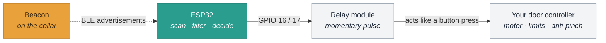
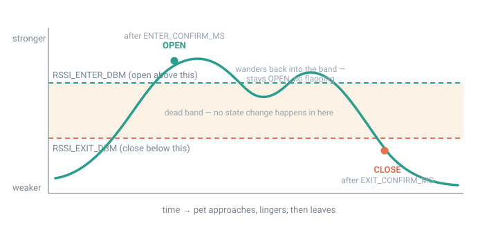

<p align="center">
  
</p>

<p align="center">
  <a href="https://github.com/jchirayath/PetDoor/actions/workflows/build.yml">
    
  </a>
  
  
  
</p>

# PetDoor

**Open a pet door when your animal walks up to it, and close it again once
they have gone.** Open source, MIT licensed, about $40 of parts on top of a
door you already own.

An ESP32 listens continuously for a Bluetooth beacon on your pet's collar. When
the beacon has been convincingly close for a moment it pulses an OPEN relay;
when it has been convincingly gone for a while it pulses a CLOSE relay. No
WiFi, no cloud, no app, no subscription — the ESP32 and the beacon are the
whole system.

---

## Why this exists

**My dog refused to use the flap.**

That is a more common problem than it sounds. A pet flap asks the animal to
push its face through a stiff, noisy barrier that then drags along its back.
Plenty of dogs and cats simply will not do it, and no amount of coaxing,
propping or treat-smearing on the flap changes their mind.

The obvious workaround is to prop the door open. That works, and it also lets
in the cold, the rain, the wind, the rodents, and whatever else fancies a warm
room — which is precisely what the flap was there to keep out.

So the requirement was:

> Let **him** come and go freely, with nothing to push through,
> and keep everything else out the rest of the time.

Neither a flap nor an open door does both. A door that **opens by itself when
he walks up to it** does:

| | Pet has to push? | Keeps weather out? | Keeps other animals out? |
|---|---|---|---|
| Pet flap | **Yes** — the dealbreaker | Yes | Mostly |
| Propped open | No | **No** | **No** |
| **PetDoor** | **No** | **Yes** | **Yes** |

The beacon on his collar is what makes the difference. The door opens for the
animal carrying it and for nothing else — not the neighbour's cat, not a
raccoon, not a draught. There is no barrier to learn, no resistance to push
against, and no training required: the doorway is simply open by the time he
gets there, and sealed again once he has gone.

That is the whole idea. Everything below is what it takes to do it reliably
enough to leave running unattended.

## What else I tried first

This was not the obvious answer. Several things looked simpler on paper.

**Proximity sensors (PIR / ultrasonic).** The first idea. The problem is that
one sensor only watches one side, so it needs **one inside and one outside** —
two sensors, two runs of cable, and an outdoor unit exposed to the weather.
Worse, it answers the wrong question: a PIR tells you *something is there*, not
*who*. It would open just as happily for a raccoon.

**Weight / pressure switches (mats).** Also promising, also defeated by the
details. A mat has to be exactly where the animal steps, and the outdoor one
sits in rain, snow, mud and leaves. Sensitivity drifts as it gets wet or frozen,
and a mat that ignores a wet leaf still cannot tell a 6 kg dog from a 6 kg
raccoon.

**RFID or microchip readers** — how commercial "microchip pet doors" work. These
genuinely solve identity, and if your pet is happy using a flap they are an
excellent choice. But the read range is only a few centimetres, so the animal
has to put its head *into* the doorway to trigger it. For a dog who will not
approach the flap in the first place, that is the one thing it cannot do.

**Infrared beam break.** Cheap and reliable, and triggers on absolutely
anything that crosses it — including blowing leaves and the cat next door.

**Camera and image recognition.** Would work, and brings its own pile of
problems: power draw, night-time lighting, a camera pointed at the house, and
real cost and complexity for a door.

**GPS collar tag.** Accuracy is 3–5 m outdoors at best and unusable indoors,
which is precisely where the door is. Battery life is measured in days.

**Ultra-wideband (UWB) tags.** Technically the best answer — around 10 cm
accuracy. But the tags are expensive, the ESP32 has no UWB radio so it needs
extra hardware, and it is considerable complexity for a door that only needs to
know "near" or "not near".

**Something on a phone.** The phone is not on the dog. And phones deliberately
randomise their Bluetooth address every few minutes, so they cannot be tracked
this way even if he carried one — see [the note on
AirTags](docs/HARDWARE.md#the-beacon), which fail for the same reason.

**A timer or light sensor**, as most automatic doors use. Cannot know where the
animal is, which is the entire problem.

### The thing that actually decides it

Almost every option above detects **presence**. Very few detect **identity**.

For a door that has to exclude raccoons, neighbouring cats and the weather,
identity is not optional — and the moment you require identity, the animal has
to carry something. Once it is carrying something, the only remaining question
is how far away that thing can be read:

| | Identifies the animal? | Useful range | Survives outdoors |
|---|---|---|---|
| PIR / ultrasonic | No | metres | needs an enclosure |
| Pressure mat | No | contact only | poorly |
| IR beam | No | across the doorway | yes |
| RFID / microchip | **Yes** | **~10 cm** | yes |
| Camera + vision | Yes | metres | needs light |
| UWB tag | **Yes** | metres, ~10 cm accuracy | yes |
| **BLE beacon** | **Yes** | **metres, tunable** | **yes** |

A BLE beacon is the only option that gets identity *and* useful range *and*
outdoor durability *and* a year of battery, for about £10. The door can open
while he is still walking toward it, which is the entire point — there is
nothing to push through because there is nothing there by the time he arrives.

The cost of that choice is that BLE signal strength is a *terrible* distance
sensor, and most of this firmware exists to deal with that.

---



The ESP32 never drives the motor. It decides **when**; your door hardware still
decides **how far** and when to stop. Keeping those separate is the core safety
idea.

## What this is actually for

**Primarily: small dogs and cats wearing a collar** — especially the ones who
refuse a flap. A collar is the natural place for a beacon: it stays on the
animal, it is easy to fit, and the door opens for *that* animal rather than for
anything that pushes on it. This is the use case the project is designed and
tuned around.

It also drives **chicken coop doors**, which is where it started, with one
practical caveat: a bird has to carry the beacon. A leg band works but is
fiddly, and a whole flock needs either one beacon per bird (supported — the MAC
list takes several) or a beacon on whichever bird is last in. Many coop users
run it the other way round: the coop door stays on its own dusk timer, and this
handles the *daytime* pop-door.

It will not work for an animal that cannot wear a beacon, and it is not a
substitute for a lock — anyone carrying the beacon opens the door.

> ⚠️ **This drives a motor attached to a door an animal walks through.**
> Read [docs/SAFETY.md](docs/SAFETY.md) before connecting anything to a real
> door. The most important decision in the build is the door mechanism, not the
> code.

## Start here

| If you... | Read |
|---|---|
| have never used an ESP32 | [docs/ESP32-PRIMER.md](docs/ESP32-PRIMER.md) |
| have a door to convert | [docs/COOP-CONVERSION.md](docs/COOP-CONVERSION.md) |
| are about to wire a motor | [docs/SAFETY.md](docs/SAFETY.md) |
| want to know how it works | [docs/ARCHITECTURE.md](docs/ARCHITECTURE.md) |

---

## Why not just use RSSI directly

Because raw BLE signal strength is far too noisy to switch on. An earlier
version of this project failed in exactly the ways you would expect, and the
firmware is built around the fixes:

| Problem | Fix |
|---|---|
| Only ever got one signal reading per device, so proximity never updated | Scan with duplicate reporting **on** — see [docs/ARCHITECTURE.md](docs/ARCHITECTURE.md#the-duplicate-filter-trap) |
| Signal spikes and dropouts from multipath | Median filter, then exponential smoothing |
| Door flapping open/closed at the threshold | Two thresholds with a hysteresis band between them — see below |
| Door closing during a brief signal dropout | 15-second dwell before closing; a stale signal can never *open* the door |
| Bluetooth stack silently wedging | Watchdog restarts the scan if the radio goes quiet |
| Motor thrash | Actuation lockout, direction interlock, post-boot grace period |

---

### The hysteresis band, visually

<p align="center">
  
</p>

One threshold would make the door flap every time the signal wobbled across it.
Two thresholds with a gap between them mean that once the door is open, the
beacon has to get *meaningfully* further away before anything changes.

## Hardware

| Part | Notes |
|---|---|
| ESP32 dev board | Classic ESP32 (WROOM). Newer S3/C3/C6 also build. |
| BLE beacon | A [Minew](https://www.minew.com/) beacon is the reference. Any beacon with a fixed MAC works. |
| 2-channel relay module | Or two MOSFET drivers. Must be rated for your door motor. |
| Door motor + controller | Whatever your coop door already uses. |
| 5 V supply | Sized for the ESP32 *and* the relay coils. |

A phone or an AirTag will **not** work as the beacon — they rotate their
Bluetooth address every few minutes specifically to prevent this kind of
tracking. You need a real beacon that advertises a fixed address.

Default pinout (change in `config.h`):

| Signal | GPIO |
|---|---|
| OPEN relay | 16 |
| CLOSE relay | 17 |
| Status LED | 23 |

Full wiring, including the active-high vs active-low relay trap, is in
[docs/WIRING.md](docs/WIRING.md).

---

## Quick start

### 1. Flash it with nothing configured

```bash
git clone https://github.com/jchirayath/PetDoor.git
cd PetDoor
arduino-cli compile --fqbn esp32:esp32:esp32 petdoor
arduino-cli upload  --fqbn esp32:esp32:esp32 -p /dev/cu.usbmodemXXXX petdoor
```

Or open `petdoor/petdoor.ino` in the Arduino IDE, select **ESP32 Dev Module**,
and click Upload. You need **ESP32 board core 3.x** installed.

With no beacon configured the firmware boots into **discovery mode** and will
not touch the door.

### 2. Find your beacon

Open the serial monitor at **115200 baud**. Every two seconds you get a table
of everything in range:

```
---- BLE devices in range ----
  MAC                RSSI  Age     Class      Name / manufacturer data
   ac:23:3f:11:22:33  -52    118ms Minew      MST01 mfg=4c000215...
   65:00:5e:00:00:01  -78    402ms AirTag     mfg=000000000000...
```

Your Minew beacon is the one that gets stronger as you walk toward it. Move it
around to confirm, and write down its MAC.

### 3. Configure it

```bash
cp petdoor/secrets.example.h petdoor/secrets.h
```

Set your beacon's address:

```c
#define BEACON_MAC "ac:23:3f:11:22:33"
```

`secrets.h` is git-ignored, so your settings survive `git pull` and your
beacon's address never ends up in a public repo. Reflash.

### 4. Tune the thresholds

Type `c` in the serial monitor and walk around:

```
[cal] raw  -61  filtered  -58 dBm  ~1.8 m  PRESENT
[cal] raw  -77  filtered  -71 dBm  ~5.2 m  absent
```

Stand where you want the door to open and note the **filtered** value. Set
`RSSI_ENTER_DBM` a few dB below it and `RSSI_EXIT_DBM` about 8–12 dB below
that. Full method in [docs/TUNING.md](docs/TUNING.md).

### 5. Wire it up

Test the relays with the `o` and `x` serial commands **before** connecting the
motor. See [docs/WIRING.md](docs/WIRING.md) and [docs/SAFETY.md](docs/SAFETY.md).

---

## Serial commands

| Key | Action |
|---|---|
| `h` | Help |
| `s` | Status — presence, door state, signal, radio health, free heap |
| `d` | Toggle discovery mode |
| `c` | Toggle the live calibration stream |
| `r` | Reset the proximity filter |
| `m` | Edit the beacon MAC list — saved on the device, no reflash needed |
| `t` | Edit the open/close thresholds — `here` calibrates from where the beacon sits |
| `!` | Reboot into flash mode (ESP32-S3/C3/C6 only; the original ESP32 has no such flag) |
| `o` | Pulse the OPEN relay now (bypasses proximity logic) |
| `x` | Pulse the CLOSE relay now (bypasses proximity logic) |

Set `ALLOW_MANUAL_SERIAL_CONTROL` to `0` for an unattended deployment to drop
`o` and `x`.

## Status LED

| Pattern | Meaning |
|---|---|
| Solid | Beacon is present |
| Off | Beacon is absent |
| Slow blink (1 Hz) | No beacon configured, or never heard since boot |
| Fast blink (5 Hz) | Radio is unhealthy — no advertisements from anything |

---

## Configuration

Everything lives in [`petdoor/config.h`](petdoor/config.h), grouped into beacon
identity, proximity, door/relay, scanning, and diagnostics. Every setting is
wrapped in `#ifndef`, so anything you put in `secrets.h` (or pass with `-D`)
wins. The settings you are most likely to touch:

| Setting | Default | What it does |
|---|---|---|
| `BEACON_MAC` | *(unset)* | Which beacon is "the key" |
| `RSSI_ENTER_DBM` | `-65` | Signal at/above this counts as near |
| `RSSI_EXIT_DBM` | `-75` | Signal at/below this counts as far |
| `ENTER_CONFIRM_MS` | `1500` | How long "near" must hold before opening |
| `EXIT_CONFIRM_MS` | `15000` | How long "far" must hold before closing |
| `RELAY_ACTIVE_LOW` | `0` | Set to `1` for the common blue relay boards |
| `RELAY_PULSE_MS` | `200` | Momentary pulse length |

See [docs/CONFIGURATION.md](docs/CONFIGURATION.md) for all of them.

---

## Documentation

- [Architecture](docs/ARCHITECTURE.md) — how the signal becomes a decision, and the duplicate-filter trap
- [Hardware](docs/HARDWARE.md) — parts, boards, beacon selection
- [Wiring](docs/WIRING.md) — pinout, relay polarity, bench test procedure
- [Beacon setup](docs/BEACON-SETUP.md) — configuring a Minew beacon
- [Configuration](docs/CONFIGURATION.md) — every setting
- [Tuning](docs/TUNING.md) — choosing thresholds that work in your coop
- [ESP32 primer](docs/ESP32-PRIMER.md) — what the board is and how to program it, from zero
- [Coop / pet door conversion](docs/COOP-CONVERSION.md) — wiring relays into a door you already own
- [Diagnostics](docs/DIAGNOSTICS.md) — connecting to the serial console, every command, and what the output means
- [Troubleshooting](docs/TROUBLESHOOTING.md) — when it does not work
- [Safety](docs/SAFETY.md) — read before connecting a motor

## Contributing

See [CONTRIBUTING.md](CONTRIBUTING.md). Issues and pull requests welcome,
especially reports from real coops.

## License

MIT — see [LICENSE](LICENSE).
