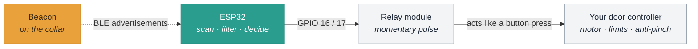

<p align="center">
  
</p>

<p align="center">
  <a href="https://github.com/jchirayath/PetDoor/actions/workflows/build.yml">
    
  </a>
  
  
  
</p>

# PetDoor

**Open a pet door when your animal walks up to it, and close it again once
they have gone.** Open source, MIT licensed, and about **$80 all in** —
door, board and cable.

An ESP32 listens continuously for a Bluetooth beacon on your pet's collar. When
the beacon has been convincingly close for a moment it pulses an OPEN relay;
when it has been convincingly gone for a while it pulses a CLOSE relay. No
cloud, no app, no subscription — the ESP32 and the beacon are the whole system.

**WiFi, the log server and the portal are all optional and all off by default.**
Out of the box the door keeps its last 128 events in its own memory, rolling the
oldest out so it cannot fill up, and nothing ever leaves it. Set a network and an
endpoint in `secrets.h` and it will additionally upload that log to a server you
run — see [LOG-SERVER.md](docs/LOG-SERVER.md). Even when enabled it stays off almost all the
time, because the ESP32 shares one antenna between WiFi and BLE — see
[the note on deferred uploads](docs/CONFIGURATION.md#why-uploads-are-deferred-rather-than-immediate).

---

## Why this exists

**My dog refused to use the flap.**

That is a more common problem than it sounds. A pet flap asks the animal to
push its face through a stiff, noisy barrier that then drags along its back.
Plenty of dogs and cats simply will not do it, and no amount of coaxing,
propping or treat-smearing on the flap changes their mind.

The obvious workaround is to prop the door open. That works, and it also lets
in the cold, the rain, the wind, the rodents, and whatever else fancies a warm
room — which is precisely what the flap was there to keep out.

So the requirement was:

> Let **him** come and go freely, with nothing to push through,
> and keep everything else out the rest of the time.

Neither a flap nor an open door does both. A door that **opens by itself when
he walks up to it** does:

| | Pet has to push? | Keeps weather out? | Keeps other animals out? |
|---|---|---|---|
| Pet flap | **Yes** — the dealbreaker | Yes | Mostly |
| Propped open | No | **No** | **No** |
| **PetDoor** | **No** | **Yes** | **Yes** |

The beacon on his collar is what makes the difference. The door opens for the
animal carrying it and for nothing else — not the neighbour's cat, not a
raccoon, not a draught. There is no barrier to learn, no resistance to push
against, and no training required: the doorway is simply open by the time he
gets there, and sealed again once he has gone.

That is the whole idea. Everything below is what it takes to do it reliably
enough to leave running unattended.

### Two more constraints

Those shaped the design as much as the requirement did.

**It had to be cheap.** A commercial microchip pet door is $150–250. If this
cost more than that, there would be no reason to build it — you would just buy
one and accept the flap. That set a hard ceiling, and it is the main reason
several otherwise-better technologies were ruled out: UWB tags are more accurate
than Bluetooth and cost several times as much, and a camera setup costs more
again before you have written a line of code.

**It had to be off-the-shelf.** No custom PCB, no 3D printing, no machining, no
firmware toolchain more exotic than the Arduino IDE. Three parts, all orderable
from one site, assembled in an evening:

| | |
|---|---|
| Automatic coop / pet door | bought, not built |
| ESP32 with relays **on the same board** | no relay wiring to get wrong |
| USB-to-TTL adapter | for programming |

The only soldering is four short wires onto button pads — and with
[Pattern 1](docs/COOP-CONVERSION.md#pattern-1-tap-a-spare-remote-easiest) those
go onto a **$12 spare remote handset** rather than into the door itself, so a
slipped iron costs you a remote instead of the door.

That constraint is also why the electronics are deliberately dull. There is no
custom board here and there does not need to be: an ESP32-with-relays module
already does the job, and anything this project adds sits in firmware where it
costs nothing to copy.

## What else I tried first

This was not the obvious answer. Several things looked simpler on paper, and
they failed in two distinct ways.

### They cannot tell *my* pet from anything else

The whole point of a door is to let one animal in and keep everything else out.
These all detect **presence** — something is there — and none of them can say
**who**. Every one of them opens just as willingly for a raccoon, a neighbour's
cat, or a blowing leaf:

**Proximity sensors (PIR / ultrasonic).** The first idea. A sensor only watches
one side, so it needs **one inside and one outside** — two sensors, two cable
runs, and an outdoor unit exposed to the weather. All that work, and it still
answers the wrong question.

**Weight / pressure switches (mats).** A mat has to be exactly where the animal
steps, and the outdoor one sits in rain, snow, mud and leaves, with sensitivity
drifting as it wets or freezes. And a mat that has been tuned to ignore a wet
leaf still cannot tell a 6 kg dog from a 6 kg raccoon.

**Infrared beam break.** Cheap, reliable, trivial to wire — and it triggers on
*anything* that crosses the beam. Same problem as the others, with no way
around it: a beam cannot know what broke it.

> Adding more of these sensors does not fix it. Two PIRs, a mat *and* a beam
> still only tell you that something is in the doorway. No combination of
> presence sensors adds up to identity.

### They can identify, but not usefully at a distance

**RFID and microchip readers** — how commercial "microchip pet doors" work.
These genuinely solve identity, and **if your pet is happy using a flap they
are an excellent choice**. But read range is only a few centimetres, so the
animal has to put its head *into* the doorway to trigger it. For a dog who will
not approach the flap in the first place, that is precisely the thing it cannot
do.

**Camera and image recognition.** Can identify, and brings its own pile of
problems: power draw, night-time lighting, a camera pointed at the house, and
real cost and complexity for a door.

**GPS collar tag.** Identifies fine, but accuracy is 3–5 m outdoors at best and
unusable indoors — which is precisely where the door is. Battery life in days.

**Ultra-wideband (UWB) tags.** Technically the best answer: identity plus ~10 cm
accuracy. But the tags are expensive, the ESP32 has no UWB radio so it needs
extra hardware, and it is a lot of complexity for a door that only needs to know
"near" or "not near". This is the option the cost constraint kills outright —
UWB would have cost more than the commercial door it was meant to replace.

**Something on a phone.** The phone is not on the dog. And phones deliberately
randomise their Bluetooth address every few minutes, so they cannot be tracked
this way even if he carried one — see [the note on
AirTags](docs/HARDWARE.md#the-beacon), which fail for the same reason.

**A timer or light sensor**, as most automatic doors use. Cannot know where the
animal is, which is the entire problem.

### The thing that actually decides it

Two requirements, and almost nothing satisfies both:

1. **Identity** — it must open for *my* animal and nothing else
2. **Range** — it must open *before* he gets there, because there is no flap to
   push through

Requirement 1 eliminates every presence sensor, however many you add.
Requirement 2 eliminates RFID, which is otherwise the right answer and is what
the commercial products use.

And the moment you require identity, the animal has to **carry** something — so
the only remaining question is how far away that thing can be read:

| | Identifies the animal? | Useful range | Survives outdoors |
|---|---|---|---|
| PIR / ultrasonic | No | metres | needs an enclosure |
| Pressure mat | No | contact only | poorly |
| IR beam | No | across the doorway | yes |
| RFID / microchip | **Yes** | **~10 cm** | yes |
| Camera + vision | Yes | metres | needs light |
| UWB tag | **Yes** | metres, ~10 cm accuracy | yes |
| **BLE beacon** | **Yes** | **metres, tunable** | **yes** |

A BLE beacon is the only option that gets identity *and* useful range *and*
outdoor durability *and* a year of battery, for about $12 — and it needs no
hardware beyond an ESP32, which is the cheapest radio that can hear it.

### "Can I just use an AirTag?"

**No — and not a Tile, a SmartTag, or a phone either.** This is the most common
question, and it has two *independent* answers, either of which is fatal on its
own. Both were measured on real hardware during this build.

#### 1. AirTags deliberately change their Bluetooth address

The firmware finds your beacon by its address. An AirTag rotates that address
on a timer, precisely so that nobody can do what this project does.

Watching one AirTag on the bench for **under two hours** produced **four
completely different addresses**, with no overlap between them. The one seen at
the start had vanished by the end.

That is not a bug or a setting — it is Apple's anti-stalking design, working
exactly as intended. Tiles, Samsung SmartTags, phones and most fitness bands do
the same thing. You cannot switch it off.

The symptom is distinctive and misleading: **it works for a few minutes after
you configure it, then silently stops**, and the door stays shut forever after.
Worse, because the firmware *did* hear the beacon once, it will happily close
the door and then never see a reason to open it again.

#### 2. Even ignoring that, they advertise far too slowly

The second reason is the more interesting one. Sitting an AirTag **two feet
from the ESP32** — the strongest signal it will ever produce — and measuring the
gaps between advertisements:

| | shortest gap | typical gap | longest gap |
|---|---|---|---|
| **AirTag**, at 2 feet | 965 ms | **5,140 ms** | **17,865 ms** |
| **Minew beacon**, further away | 72 ms | **349 ms** | 885 ms |

The Minew is roughly **15× faster**, from further away.

Why that matters: the firmware treats a reading older than `SAMPLE_MAX_AGE_MS`
(3 s) as stale, and stale counts as *gone*. The AirTag's **typical** gap already
exceeds that, so more than half the time it would register as absent while
sitting right next to the door. And its longest gap — nearly 18 seconds —
exceeds `EXIT_CONFIRM_MS`, meaning **the door would close with the AirTag two
feet away.**

No amount of retuning rescues it. Tolerating an 18-second gap would mean a
20-second staleness window, ~15 seconds just to acquire a fix, and ~35 seconds
to fill the median filter. With samples that far apart there is nothing left to
filter, and you would be switching a motor on sparse raw RSSI — exactly the
failure this project was built to fix.

#### What about "open for *any* AirTag"?

Technically possible — AirTags are identifiable as a *class* by their Find My
payload, and the firmware already labels them in the discovery table. But it
fails on all three counts: the rate problem above is unchanged, every visitor's
AirTag would open your door, and Apple's unwanted-tracking alerts will start
notifying nearby iPhones about a tag that is "travelling with" someone.

#### So what do you need?

A **purpose-built BLE beacon with a fixed public address**, advertising
continuously. That is what a Minew tag is, and it costs about $12. See
[HARDWARE.md](docs/HARDWARE.md#the-beacon) for what to look for, and
[DIAGNOSTICS.md](docs/DIAGNOSTICS.md#can-i-use-this-device-as-a-beacon) for how
to tell from the address alone whether a device you already own will work. The door can open
while he is still walking toward it, which is the entire point — there is
nothing to push through because there is nothing there by the time he arrives.

The cost of that choice is that BLE signal strength is a *terrible* distance
sensor, and most of this firmware exists to deal with that.

---



The ESP32 never drives the motor. It decides **when**; your door hardware still
decides **how far** and when to stop. Keeping those separate is the core safety
idea.

## What this is actually for

**Primarily: small dogs and cats wearing a collar** — especially the ones who
refuse a flap. A collar is the natural place for a beacon: it stays on the
animal, it is easy to fit, and the door opens for *that* animal rather than for
anything that pushes on it. This is the use case the project is designed and
tuned around.

It also drives **chicken coop doors**, which is where it started, with one
practical caveat: a bird has to carry the beacon. A leg band works but is
fiddly, and a whole flock needs either one beacon per bird (supported — the MAC
list takes several) or a beacon on whichever bird is last in. Many coop users
run it the other way round: the coop door stays on its own dusk timer, and this
handles the *daytime* pop-door.

It will not work for an animal that cannot wear a beacon.

**It is not a lock, and it is weaker than it looks.** BLE advertisements are
unauthenticated plaintext, so the door opens for anything broadcasting your
beacon's address — not only for the beacon itself. Anyone who has been within
radio range with a scanner can read that address and rebroadcast it from a $10
board. This is a property of BLE advertising, not something this firmware can
fix: there is no shared secret to verify against.

In practice that is fine for keeping out weather, rodents and the neighbour's
cat, which is what it was built for. It is not fine as your only barrier
against a person. Keep a real lock on anything that matters, and treat the
beacon as a convenience rather than a credential.

> ⚠️ **This drives a motor attached to a door an animal walks through.**
> Read [docs/SAFETY.md](docs/SAFETY.md) before connecting anything to a real
> door. The most important decision in the build is the door mechanism, not the
> code.

## Start here

| If you... | Read |
|---|---|
| have never used an ESP32 | [docs/ESP32-PRIMER.md](docs/ESP32-PRIMER.md) |
| have a door to convert | [docs/COOP-CONVERSION.md](docs/COOP-CONVERSION.md) |
| are about to wire a motor | [docs/SAFETY.md](docs/SAFETY.md) |
| want to know how it works | [docs/ARCHITECTURE.md](docs/ARCHITECTURE.md) |

---

## Why not just use RSSI directly

Because raw BLE signal strength is far too noisy to switch on. An earlier
version of this project failed in exactly the ways you would expect, and the
firmware is built around the fixes:

| Problem | Fix |
|---|---|
| Only ever got one signal reading per device, so proximity never updated | Scan with duplicate reporting **on** — see [docs/ARCHITECTURE.md](docs/ARCHITECTURE.md#the-duplicate-filter-trap) |
| Signal spikes and dropouts from multipath | Median filter, then exponential smoothing — run twice, fast for opening and slow for closing |
| Bluetooth stack eating over half the flash | Optional NimBLE build — one library, 89% → 65% — see [docs/CONFIGURATION.md](docs/CONFIGURATION.md#ble-host-stack) |
| Door flapping open/closed at the threshold | Two thresholds with a hysteresis band between them — see below |
| Door closing during a brief signal dropout | 15-second dwell before closing; a stale signal can never *open* the door |
| Bluetooth stack silently wedging | Watchdog restarts the scan if the radio goes quiet |
| Motor thrash | Actuation lockout, direction interlock, post-boot grace period |

---

### The hysteresis band, visually

<p align="center">
  
</p>

One threshold would make the door flap every time the signal wobbled across it.
Two thresholds with a gap between them mean that once the door is open, the
beacon has to get *meaningfully* further away before anything changes.

## Parts list

Prices are typical US street prices as of 2026 and will drift.

**The whole build is about $80.** That is the real figure from this project,
not a best-case sum.

| # | Part | Cost | Notes |
|---|---|---|---|
| 1 | **Automatic coop / pet door** | **$40–50** | The basic aluminium auto-door kits |
| 2 | **ESP32 board with 2 relays on-board** | **$15–20** | Search "ESP32 relay 2 channel". One board, no relay wiring |
| 3 | **USB-to-TTL adapter (CP2102)** | **$8–10** | Required — these boards have no USB port |
| | **Total** | **~$80** | |

Then whatever you do not already have:

| Part | Cost | Notes |
|---|---|---|
| BLE beacon | $10–15 | Must have a *fixed* MAC. See [HARDWARE.md](docs/HARDWARE.md#the-beacon) |
| Power supply | $8–12 | Check the board's input range — many want 7–30 V DC, not 5 V |
| Weatherproof enclosure | $10–15 | Not optional outdoors |
| *Optional:* spare remote for the door | $10–15 | Enables the easiest wiring — [Pattern 1](docs/COOP-CONVERSION.md#pattern-1-tap-a-spare-remote-easiest) |

For comparison, a commercial microchip-reading pet door is **$150–250** — and
still requires the animal to push through a flap, which is the thing this was
built to avoid.

### Spending more on the door is the upgrade worth making

The $40–50 doors work, and it is where this build started. If you are going to
spend more anywhere, spend it on the door rather than the electronics:
**$80–180 buys anti-pinch** (obstruction detection), which is the one safety
feature this firmware structurally cannot provide. Some also add a remote
control, which unlocks the easiest possible wiring.

See [SAFETY.md](docs/SAFETY.md) — the door mechanism is the most important
decision in the build, and it is not a software one.

### Why the integrated ESP32 + relay board

Buying an ESP32 board with the relays **already on it** removes the single
most error-prone part of the build: wiring a separate relay module, getting the
common ground right, and picking the correct `RELAY_ACTIVE_LOW` polarity. On an
integrated board the manufacturer has already done that, and the relay contacts
come out on screw terminals.

Three things to check on whichever board you buy:

1. **Which GPIO pins drive the relays.** They are fixed by the PCB and vary by
   manufacturer — GPIO 16/17, 32/33 and 25/26 are all common. Set
   `PIN_RELAY_OPEN` and `PIN_RELAY_CLOSE` to match; the firmware defaults to
   **16 and 17**.
2. **The input voltage.** Many of these boards take 7–30 V DC rather than 5 V,
   because they are designed for industrial panels. Feeding 5 V to a board
   expecting 12 V simply will not boot; feeding 12 V to a 5 V board destroys it.
3. **Whether there is a USB socket.** Most have none — you program them through
   a TTL header, which is why item 3 is not optional.

### The USB-to-TTL adapter

You need this to get the firmware onto the board and to reach the serial
console. A **CP2102** module is the common choice. Wire four pins:

```
   adapter GND  ->  board GND
   adapter TX   ->  board RX     (crossed)
   adapter RX   ->  board TX     (crossed)
   adapter 5V   ->  board 5V     only if the board is not otherwise powered
```

**TX and RX cross over.** This is the classic mistake: TX-to-TX gives you a
silent port and no error message.

> **Strongly recommended:** also wire `DTR -> IO0` and `RTS -> EN`. Without
> them, every single firmware upload needs a manual button sequence — hold IO0,
> tap EN, release IO0 — which gets old fast. Two extra wires buy you hands-free
> flashing forever. See
> [DIAGNOSTICS.md](docs/DIAGNOSTICS.md#which-chips-can-skip-the-buttons).

Once the firmware is on, all configuration happens over this same serial link
and is stored on the device — you do not reflash to change the beacon or the
thresholds.

## Hardware

| Part | Notes |
|---|---|
| ESP32 dev board | Classic ESP32 (WROOM). Newer S3/C3/C6 also build. |
| BLE beacon | A [Minew](https://www.minew.com/) beacon is the reference. Any beacon with a fixed MAC works. |
| 2-channel relay module | Or two MOSFET drivers. Must be rated for your door motor. |
| Door motor + controller | Whatever your coop door already uses. |
| 5 V supply | Sized for the ESP32 *and* the relay coils. |

A phone or an AirTag will **not** work as the beacon — they rotate their
Bluetooth address every few minutes specifically to prevent this kind of
tracking. You need a real beacon that advertises a fixed address.

Default pinout (change in `config.h`):

| Signal | GPIO |
|---|---|
| OPEN relay | 16 |
| CLOSE relay | 17 |
| Status LED | 23 |

Full wiring, including the active-high vs active-low relay trap, is in
[docs/WIRING.md](docs/WIRING.md).

---

## Quick start

### 1. Flash it with nothing configured

```bash
git clone https://github.com/jchirayath/PetDoor.git
cd PetDoor
arduino-cli compile --fqbn esp32:esp32:esp32 petdoor
arduino-cli upload  --fqbn esp32:esp32:esp32 -p /dev/cu.usbmodemXXXX petdoor
```

Or open `petdoor/petdoor.ino` in the Arduino IDE, select **ESP32 Dev Module**,
and click Upload. You need **ESP32 board core 3.x** installed.

With no beacon configured the firmware boots into **discovery mode** and will
not touch the door.

### 2. Find your beacon

Open the serial monitor at **115200 baud**. Every two seconds you get a table
of everything in range:

```
---- BLE devices in range ----
  MAC                RSSI  Age     Class      Name / manufacturer data
   ac:23:3f:11:22:33  -52    118ms Minew      MST01 mfg=4c000215...
   65:00:5e:00:00:01  -78    402ms AirTag     mfg=000000000000...
```

Your Minew beacon is the one that gets stronger as you walk toward it. Move it
around to confirm, and write down its MAC.

### 3. Configure it

```bash
cp petdoor/secrets.example.h petdoor/secrets.h
```

Set your beacon's address:

```c
#define BEACON_MAC "ac:23:3f:11:22:33"
```

`secrets.h` is git-ignored, so your settings survive `git pull` and your
beacon's address never ends up in a public repo. Reflash.

### 4. Tune the thresholds

Type `c` in the serial monitor and walk around:

```
[cal] raw  -61  filtered  -58 dBm  ~1.8 m  PRESENT
[cal] raw  -77  filtered  -71 dBm  ~5.2 m  absent
```

Stand where you want the door to open and note the **filtered** value. Set
`RSSI_ENTER_DBM` a few dB below it and `RSSI_EXIT_DBM` about 8–12 dB below
that. Full method in [docs/TUNING.md](docs/TUNING.md).

### 5. Wire it up

Test the relays with the `o` and `x` serial commands **before** connecting the
motor. See [docs/WIRING.md](docs/WIRING.md) and [docs/SAFETY.md](docs/SAFETY.md).

---

## Serial commands

| Key | Action |
|---|---|
| `h` | Help |
| `s` | Status — presence, door state, signal, radio health, free heap |
| `d` | Toggle discovery mode |
| `c` | Toggle the live calibration stream |
| `r` | Reset the proximity filter |
| `m` | Edit the beacon MAC list — saved on the device, no reflash needed |
| `t` | Edit the open/close thresholds — `here` calibrates from where the beacon sits |
| `!` | Reboot into flash mode (ESP32-S3/C3/C6 only; the original ESP32 has no such flag) |
| `o` | Pulse the OPEN relay now (bypasses proximity logic) |
| `x` | Pulse the CLOSE relay now (bypasses proximity logic) |

Set `ALLOW_MANUAL_SERIAL_CONTROL` to `0` for an unattended deployment to drop
`o` and `x`.

## Status LED

| Pattern | Meaning |
|---|---|
| Solid | Beacon is present |
| Off | Beacon is absent |
| Slow blink (1 Hz) | No beacon configured, or never heard since boot |
| Fast blink (5 Hz) | Radio is unhealthy — no advertisements from anything |

---

## Configuration

Everything lives in [`petdoor/config.h`](petdoor/config.h), grouped into beacon
identity, proximity, door/relay, scanning, and diagnostics. Every setting is
wrapped in `#ifndef`, so anything you put in `secrets.h` (or pass with `-D`)
wins. The settings you are most likely to touch:

| Setting | Default | What it does |
|---|---|---|
| `BEACON_MAC` | *(unset)* | Which beacon is "the key" |
| `RSSI_ENTER_DBM` | `-65` | Signal at/above this counts as near |
| `RSSI_EXIT_DBM` | `-75` | Signal at/below this counts as far |
| `ENTER_CONFIRM_MS` | `1500` | How long "near" must hold before opening |
| `EXIT_CONFIRM_MS` | `15000` | How long "far" must hold before closing |
| `RELAY_ACTIVE_LOW` | `0` | Set to `1` for the common blue relay boards |
| `RELAY_PULSE_MS` | `200` | Momentary pulse length |

See [docs/CONFIGURATION.md](docs/CONFIGURATION.md) for all of them.

---

## Documentation

- [Architecture](docs/ARCHITECTURE.md) — how the signal becomes a decision, and the duplicate-filter trap
- [Hardware](docs/HARDWARE.md) — parts, boards, beacon selection
- [Wiring](docs/WIRING.md) — pinout, relay polarity, bench test procedure
- [Beacon setup](docs/BEACON-SETUP.md) — configuring a Minew beacon
- [Configuration](docs/CONFIGURATION.md) — every setting
- [Tuning](docs/TUNING.md) — choosing thresholds that work in your coop
- [ESP32 primer](docs/ESP32-PRIMER.md) — what the board is and how to program it, from zero
- [Coop / pet door conversion](docs/COOP-CONVERSION.md) — wiring relays into a door you already own
- [Diagnostics](docs/DIAGNOSTICS.md) — connecting to the serial console, every command, and what the output means
- [Log server](docs/LOG-SERVER.md) — *optional* — collect history on a machine of your own
- [Web dashboard](docs/WEB-DASHBOARD.md) — *optional* — self-host the charts on a Pi or a VM
- [Portal](docs/PORTAL.md) — *optional* — the same charts, hosted, with nothing to run
- [Troubleshooting](docs/TROUBLESHOOTING.md) — when it does not work
- [Safety](docs/SAFETY.md) — read before connecting a motor

## Contributing

See [CONTRIBUTING.md](CONTRIBUTING.md). Issues and pull requests welcome,
especially reports from real coops.

## License

MIT — see [LICENSE](LICENSE).
