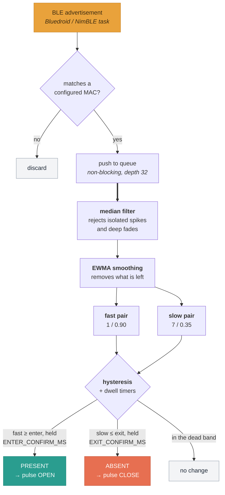
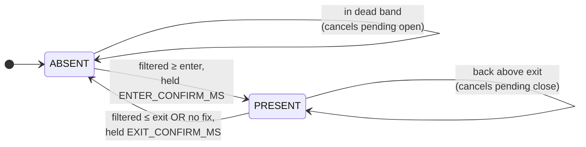

# Architecture

How a noisy radio signal becomes a decision to move a door.

---

## The problem

Bluetooth RSSI is a terrible distance sensor. A beacon sitting perfectly still
two metres away will report values swinging over a 20 dBm range, with occasional
dropouts lasting seconds. Switch a door directly on that number and the door
flaps open and closed all afternoon.

Every stage below exists to turn that signal into something you can safely
switch a motor on.

---

## The pipeline



The double arrow marks the task boundary: everything above it runs in the BLE
callback and must stay cheap, everything below runs in `controlTask`.

### As a state machine



Note the asymmetry: **no fix counts as "≤ exit" but never as "≥ enter"**, which
is why losing the beacon can only ever close the door.

<p align="center">
  
</p>

## The pipeline in detail

```
   BLE radio
       │  every advertisement, ~10/s from a typical beacon
       ▼
  ┌──────────────────────────────────────────┐
  │ ScanCallbacks::onResult()                │  Bluedroid/NimBLE task
  │   match against the configured beacon    │  must stay cheap, never block
  │   push {rssi, measuredPower, atMs}       │
  └──────────────────┬───────────────────────┘
                     │  FreeRTOS queue, depth 32, non-blocking send
                     ▼
  ┌──────────────────────────────────────────┐
  │ controlTask(), every CONTROL_TICK_MS     │  core 1, owns all state
  │                                          │
  │  1. drain queue → ProximityTracker       │
  │  2. tracker.update(now)                  │
  │  3. scan watchdog                        │
  │  4. drive the door                       │
  │  5. LED + serial console                 │
  └──────────────────┬───────────────────────┘
                     ▼
  ┌──────────────────────────────────────────┐
  │ DoorController                           │
  │   interlock, lockout, boot grace         │
  │   pulse a relay                          │
  └──────────────────────────────────────────┘
```

### Stage 1 — median filter

The most recent samples, sorted, middle one taken — `RSSI_MEDIAN_WINDOW` (7) of
them for the close decision, `RSSI_FAST_WINDOW` (1, i.e. none) for the open one.
Both read the same 15-entry ring, each taking as many of the newest entries as
its window asks for.

A median is the right tool here because BLE RSSI noise is dominated by
**isolated outliers** — a deep multipath fade or a spike lasting one or two
packets. A mean would let a single −95 dBm fade drag the average down; a median
discards it entirely. Sorting is a straight insertion sort: the window is at
most 15 elements, so anything cleverer would be slower.

### Stage 2 — exponential smoothing

`ewma = α · median + (1 − α) · ewma`, run twice: `RSSI_EWMA_ALPHA` (0.35) over
the slow median, `RSSI_FAST_ALPHA` (0.9) over the fast one.

The median removes spikes but still steps around. The EWMA smooths what is
left. Lower α is steadier but slower to react.

### Why the filter runs twice

Opening late can shut an animal out of the coop. Closing early can shut a door
on one. A single filter has to sit somewhere between "reacts now" and "ignores
dropouts", and either choice makes one of those two directions worse. Running it
at two speeds costs 64 bytes of RAM and ~2 KB of flash, and removes the
compromise entirely:

- the **fast** value feeds `near`, which starts the open dwell — and which also
  cancels a pending close, so an animal walking back into a closing door is
  noticed on the very next advertisement rather than after the slow filter has
  climbed back over the exit threshold;
- the **slow** value feeds `far`, which starts the close dwell, so a fade or a
  dropped packet cannot talk the door shut.

A fast filter is safe here because it is not what confirms anything. The dwell
timers do that: the fast value has to stay above `RSSI_ENTER_DBM` for the whole
of `ENTER_CONFIRM_MS` before the door moves, so a single strong spike still
cannot open it.

Measured against a 1 Hz beacon, open latency drops from 3500 ms (one filter
tuned for responsiveness) or 7500 ms (one filter at the shipped shape) to
1500 ms — which is `ENTER_CONFIRM_MS` exactly, meaning the filter contributes no
lag of its own at all.

The ordering is an invariant, not a preference: the open pair must never be
slower than the close pair, or the door would notice an animal leaving before it
noticed one arriving. `static_assert` enforces it for the compiled defaults and
`applyFastFilter()` enforces it for anything typed at the console.

### Stage 3 — hysteresis and dwell

Two thresholds, not one:

```
  stronger
     ▲
     │  ────────────────────  RSSI_ENTER_DBM  (−65)   → counts as "near"
     │         dead band — no state change happens in here
     │  ────────────────────  RSSI_EXIT_DBM   (−75)   → counts as "far"
     ▼
  weaker
```

A single threshold means a signal hovering on it toggles constantly. Two
thresholds with a gap between them mean that once the door is open, the beacon
must get **meaningfully** weaker before anything changes.

On top of that, two dwell timers:

| | Threshold | Dwell | Why asymmetric |
|---|---|---|---|
| Opening | ≥ `RSSI_ENTER_DBM` | `ENTER_CONFIRM_MS` (1.5 s) | Arriving should feel responsive |
| Closing | ≤ `RSSI_EXIT_DBM` | `EXIT_CONFIRM_MS` (15 s) | A false close is far worse than a late close |

The 15-second close dwell is what rides out the dropouts that made the original
prototype unusable. Any sample back above the exit threshold cancels the pending
close outright.

---

## The safety asymmetry

This is the design decision that matters most, and it appears in three places.

**A stale or missing signal counts as *far*, but never as *near*.**

```cpp
const bool near = fix && filteredRssi_ >= RSSI_ENTER_DBM;
const bool far  = !fix || filteredRssi_ <= RSSI_EXIT_DBM;
```

`hasFix()` requires at least `MIN_SAMPLES_FOR_FIX` samples ever, and a sample
within the last `SAMPLE_MAX_AGE_MS`. So losing the beacon can only ever lead to
the door closing — never to it opening. An opening decision always requires
positive, recent evidence that the beacon is genuinely close.

Layered on top, in `driveDoor()`:

- The door is never operated at all unless a beacon is configured.
- The door is never operated until the target has been heard **once since
  boot** — so a beacon with a flat battery reads as "not yet known", not as
  "absent". Without this rule, a dead battery would close the door and keep it
  shut.

And in `DoorController::requestClose()`:

- No close during `BOOT_GRACE_MS`. After a power blip the door's real position
  is unknown, and the one outcome worth engineering against is slamming it on an
  animal standing in the doorway.

Note the direction of each rule: they all make **closing harder or opening
harder**, never the reverse.

---

## Concurrency

Two tasks touch the interesting state.

**The BLE callback task** (Bluedroid or NimBLE, depending on the chip) runs
`ScanCallbacks::onResult()`. It must stay short — it is on the stack's own
callback path, and blocking it stalls the radio. So it:

- parses the advertisement and matches it against the configured identity,
- pushes a `BleSample` onto a queue with a **zero timeout** (a full queue drops
  the newest sample and bumps a counter; the filter needs a steady stream, not
  every packet),
- takes the discovery table mutex with a **zero timeout** and simply skips the
  update if it is busy.

It never prints and never waits.

**`controlTask`** owns everything else: the `ProximityTracker` and the
`DoorController` are touched from nowhere else. `loop()` does nothing but sleep.
Door state having exactly one owner is what makes the interlock and lockout
reasoning sound — there is no path by which two decisions race.

### Timestamps cross a task boundary: never subtract them raw

The control task samples `now = millis()` once at the top of each tick and
passes that value down. But two timestamps are written by the **BLE callback
task**:

- `g_lastAdvMs` / `SeenDevice::lastSeenMs` in `ble_scanner.cpp`
- `BleSample::atMs`, which becomes `ProximityTracker::lastSeenMs_`

An advertisement arriving *after* `now` was sampled but *before* the value is
used leaves the stored timestamp a few milliseconds **ahead** of `now`. The
obvious `now - lastSeen` then underflows through zero to roughly 2^32, and a
reading that is as fresh as it is possible to be reports an age of about
49 days.

This is not hypothetical. Measured on hardware, **40% of status prints** showed
`last 4294967295 ms ago`, and the same expression gates the scan watchdog, the
LED health check and `hasFix()`.

So every such age goes through a clamped accessor:

| Owner | Use this | Not this |
|---|---|---|
| `BleScanner` | `advAgeMs(nowMs)` | `nowMs - lastAdvMs()` |
| `ProximityTracker` | `sampleAgeMs(nowMs)` | `nowMs - lastSeenMs()` |

```cpp
return (nowMs > lastSeenMs_) ? (nowMs - lastSeenMs_) : 0;
```

The clamp does **not** weaken the "a stale signal can close the door but never
open it" rule. A genuinely stale sample still has `lastSeenMs_ < nowMs` and
still reads stale. Only the future-timestamp case changes — and there the old
behaviour was simply wrong: `hasFix()` returned false for a brand-new sample,
which cancels a pending open and delays the door.

---

## The duplicate filter trap

**This is the bug the whole project exists to fix, and it is worth
understanding before you change anything in `ble_scanner.cpp`.**

The predecessor sketch scanned continuously and yet proximity never worked. The
RSSI it acted on was whatever the beacon happened to report at boot, frozen
forever. The cause was two lines:

```cpp
scan->setAdvertisedDeviceCallbacks(new ScanCallbacks());  // wantDuplicates = false
scan->start(0, nullptr, false);                           // scan forever
```

The second argument to `setAdvertisedDeviceCallbacks()` is `wantDuplicates`, and
it **defaults to false**. That default does two things:

1. It enables the BLE **controller's** duplicate filter, so the hardware itself
   suppresses repeat advertisements from an address it has already reported.
2. It makes `BLEScan.cpp` bail out in its own results map with
   *"Ignoring %s, already seen it"* for any address already present.

In a scan with a finite duration this is reasonable — results are cleared
between scans, so you get one callback per device per scan and you re-scan to
get fresh readings. But with `duration = 0` the scan never ends, the results map
is never cleared, and the filter therefore holds **forever**.

The result: exactly one callback per device, for the lifetime of the boot. One
RSSI sample. A proximity filter fed one sample cannot detect proximity.

The fix is one argument:

```cpp
g_scan->setAdvertisedDeviceCallbacks(&g_callbacks, true);
```

With `wantDuplicates = true`, every advertisement is reported and a typical
beacon yields roughly 10 samples a second — which is what the median filter and
the EWMA were designed to consume.

> **Do not "clean up" that argument.** It looks redundant — the library has a
> default, and the default is what most examples pass. Removing it silently
> restores the exact bug this firmware was written to fix, and the symptom is
> not a crash or a compile error. It is a door that simply stops responding to
> where the beacon is. The comment above the line in `ble_scanner.cpp` says so;
> keep the comment with the code.

### The related trap: `clearResults()` on restart

The scan watchdog restarts the scan when no advertisement has arrived from *any*
device for `SCAN_WATCHDOG_MS`. That restart calls `clearResults()` before
re-applying the settings — because the results map is also a memory leak across
a long-running scan, and because the settings must be re-applied after a stop.

Silence from *every* device is the signal used deliberately. There is
essentially always some BLE traffic in range; total silence means the stack is
wedged, not that the neighbourhood went quiet.

---

## Discovery table

A fixed array of `DEVICE_TABLE_SIZE` (40) entries with **LRU eviction** — no
dynamic allocation beyond what the Arduino `String` API forces, because the
writes happen from the BLE callback. Per-device writes are throttled to
`TABLE_MIN_UPDATE_MS`; between throttled writes only RSSI and timestamp are
refreshed, which avoids churning the heap in a busy RF environment.

The table costs heap and CPU in the hot path, so it defaults **on only when no
beacon is configured** — when helping you find your beacon is the only useful
thing the firmware can do. Toggle it later with `d`.

Device classification (`classifyDevice()` in `beacon.cpp`) is best-effort
labelling to help you pick your beacon out of the list. It is a display
convenience and plays no part in matching.

---

## Why no WiFi

There is none, deliberately. No cloud, no MQTT, no app, no OTA. The ESP32 and
the beacon are the whole system.

A coop door needs to work when the internet is down, when the router is
rebooting, and in five years when whatever service it depended on has been
switched off. It also removes a large attack surface from a device whose job is
deciding when your animals are locked in for the night.

The cost is that the only interface is the serial console, which is why so much
diagnostic effort goes into it.

---

## The two BLE stacks

The firmware builds against either host stack, selected by `PETDOOR_USE_NIMBLE`:

- **Bluedroid** (`0`, the default) ships with the ESP32 Arduino core. Nothing to
  install.
- **NimBLE** (`1`) comes from the NimBLE-Arduino library, which bundles the
  whole NimBLE host as Arduino sources. Still the Arduino IDE; one extra library
  from Library Manager.

Same radio, same controller — only the host stack changes. Bluedroid is over
half the image, so the difference is large:

| Full firmware, `min_spiffs`, WiFi on | flash | | RAM |
|---|---|---|---|
| Bluedroid | 1,760,679 | 89% | 72,924 |
| NimBLE | 1,295,523 | 65% | 67,740 |
| **saving** | **465,156** (454 KB) | | **5,184** |

Bluedroid's host (`libbt.a`, 521 KB linked) is what goes away; the controller
(`libbtdm_app.a`, 133 KB) is shared and stays.

Everything the two stacks disagree about is confined to the **stack adapter** at
the top of `ble_scanner.cpp` — class names, the callback signature, `start()`'s
argument list, and `String` versus `std::string`. Below that block the scanner is
written once, as templates on the advertised-device type, and is stack-agnostic:

```cpp
template <typename DevT>
void handleAdvert(DevT &device);   // DevT = BLEAdvertisedDevice
                                   //     or const NimBLEAdvertisedDevice
```

Templating on the device type rather than writing two copies also sidesteps the
two stacks disagreeing about constness — NimBLE hands over a `const` pointer,
Bluedroid a mutable value.

**Add new differences to the adapter, never `#if` in the middle of the logic.**
Two divergent copies of the advertisement handler is exactly how a fix lands in
one stack and not the other.

Note that the duplicate-filter trap below is *Bluedroid-specific* in its
"already seen it" half — NimBLE has no results-map bail-out. The other half, the
controller's own duplicate filter, applies to both, so both pass
`wantDuplicates = true`.

### Two NimBLE defaults that must be overridden

Both are the same shape as the duplicate-filter trap: a library default that is
correct for a scan with an end, and quietly wrong for one without. This firmware
scans forever.

**`setScanResponseTimeout(100)`** — NimBLE's default is 10240 ms. When a beacon
advertises as scannable (`ADV_IND`/`ADV_SCAN_IND`), NimBLE holds the
advertisement back waiting for a scan response, releasing it on that timer *or*
when the scan completes. A scannable beacon that ignores scan requests would
therefore be reported once per 10.24 s — more than three times
`SAMPLE_MAX_AGE_MS`, so `hasFix()` would be false essentially always and the
door would never open. Broadcast-only beacons are reported immediately and never
enter this path, which is what makes the failure intermittent across beacon
models rather than obvious.

**`setMaxResults(0)`** — NimBLE's default is `0xFF`, meaning it stores every
distinct device it has ever seen, freed only by `clearResults()`. This firmware
calls that only from the scan watchdog, which never fires while things are
working. Nearby phones rotate their BLE addresses every few minutes, so each
rotation is a new "device" and the list grows for as long as the door has power.
`0` means callbacks only: NimBLE frees each device once the callback has run,
and the bounded LRU table in `ble_scanner.cpp` stays the only device list.

The Bluedroid path needs neither. It already deletes each device when
`wantDuplicates` is true, and has no scan-response holding list.

---

## Portability

Beyond the two stacks, the S3/C3/C6 parts are supported by the same code. Flash
usage depends on the two big switches — see
[CONFIGURATION.md](CONFIGURATION.md#ble-host-stack). If you add much, switch
partition schemes rather than quietly trimming features.

---

## File map

| File | Responsibility |
|---|---|
| `petdoor.ino` | setup, control task, serial console, door decision |
| `config.h` | every tunable, each wrapped in `#ifndef` |
| `secrets.h` | git-ignored local overrides; may not exist |
| `ble_scanner.*` | BLE stack, scan, target matching, discovery table |
| `proximity.*` | dual-rate median + EWMA filters, hysteresis state machine |
| `door.*` | relay pulses, interlock, lockout, boot grace |
| `beacon.*` | iBeacon parsing, classification, distance estimate — pure functions |

`beacon.*` has no BLE stack dependency at all, which makes it the easy file to
unit test or reuse.

## Invariants

Enforced by `static_assert` where possible:

1. `RSSI_ENTER_DBM > RSSI_EXIT_DBM` — the gap is the hysteresis band.
2. `MIN_ACTUATION_INTERVAL_MS < EXIT_CONFIRM_MS` — or the lockout delays
   closing.
3. `RSSI_MEDIAN_WINDOW` is odd, 3–15; `RSSI_FAST_WINDOW` is odd, 1–15.
4. `RSSI_FAST_WINDOW ≤ RSSI_MEDIAN_WINDOW` and `RSSI_FAST_ALPHA ≥
   RSSI_EWMA_ALPHA` — the open path must never lag the close path.
5. `SCAN_WINDOW_MS <= SCAN_INTERVAL_MS`.
6. `PIN_RELAY_OPEN != PIN_RELAY_CLOSE`.

And enforced by design, not by the compiler:

7. A stale signal can close the door but never open it.
8. Never actuate before the beacon has been heard once since boot.
9. Never close during `BOOT_GRACE_MS`.
10. Relays are interlocked — `pulse()` always releases the opposite relay and
    waits `DIRECTION_CHANGE_GAP_MS` first.
11. The BLE callback stays cheap and never blocks.
12. Door state is owned by `controlTask` alone.
13. **Opening is never rate-limited.** The actuation lockout applies only to
    closing. A lockout can only prevent thrash by *delaying* an actuation, and
    delaying an open is the one direction that can strand an animal outside a
    door it just watched close. Thrash stays impossible anyway: a close needs
    the full exit dwell of confirmed absence first.
