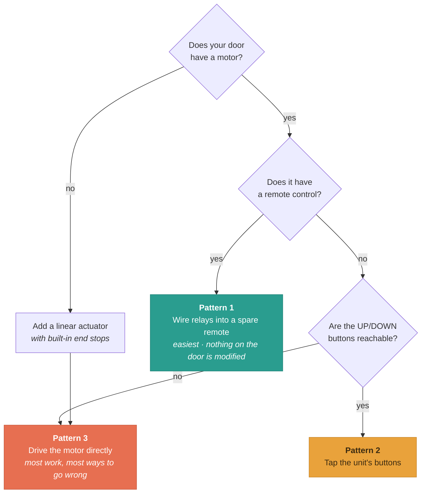

# Converting an existing coop door

**Read [SAFETY.md](SAFETY.md) first.** This page is about wiring; that one is
about not hurting an animal.

The goal is to keep your door's existing motor and controller, and replace only
the *decision* — swapping "open at sunrise on a timer" or "open when something
pushes the flap" for "open when **my** animal is at the door".

That distinction matters for the common case this project was built for: a pet
that will not use a flap at all. If your animal refuses to push through a
barrier, the door has to already be open when they arrive — which means
something has to know they are coming. A timer cannot; a beacon can.

---

## Which doors can be converted




Most people start from one of three places.

### A. A commercial automatic coop door (easiest, recommended)

The widely-sold aluminium auto-door kits — weatherproof, motor in a housing,
timer or light sensor, LED screen — are the **best case**. They already
contain:

- a motor sized for the door
- a controller that runs the motor and stops it at the ends of travel
- manual **UP** and **DOWN** buttons, and often an **RF remote**

Those last two are the integration points. PetDoor simply presses the buttons.
You are not rewiring the motor, not choosing a motor driver, not deciding when
to stop — the door keeps doing all of that.

**When buying one, the single most important feature is anti-pinch** (also sold
as "obstruction detection", "anti-crush" or "rebound"). A door with anti-pinch
senses resistance and stops or reverses instead of continuing to pull. This
firmware is open-loop and **cannot** detect an animal in the doorway — so that
protection has to come from the door. Kits advertising *anti-pinch alert*,
*solar powered*, *light sensor* and *remote control* are common and typically
in the £70–150 / $80–180 range.

Feature checklist, most to least important:

| Feature | Why |
|---|---|
| **Anti-pinch / obstruction detection** | The only thing standing between the motor and a trapped bird |
| **Remote control** | Enables the easiest, least invasive integration — [Pattern 1](#pattern-1-tap-a-spare-remote-easiest) |
| Accessible UP/DOWN buttons | Fallback integration point — [Pattern 2](#pattern-2-tap-the-units-buttons) |
| Its own limit detection | Means PetDoor only ever sends a momentary "go" |
| Timer / light sensor | Free fallback if the ESP32 is off |
| Solar / battery | Keeps working through a power cut |

### B. A manual door with no motor

You need to add a motor first, and the choice matters enormously for safety —
see [SAFETY.md](SAFETY.md#choose-a-door-mechanism-that-fails-safe). A **12 V
linear actuator with built-in end stops** is the friendliest option: it stalls
harmlessly, has its own limits, and takes a simple two-wire reversing signal.

### C. A door with a motor but a dead or unwanted controller

Treat it as case B: you are providing the drive. You will need an H-bridge or a
pair of interlocked relays plus limit switches. This is the most work and the
most ways to get it wrong.

---

## Pattern 1: tap a spare remote (easiest)

**If your door came with an RF remote, buy a second one and wire into that.**
This is the least invasive option available and it is the one I would start
with.

```
        spare remote handset
       ┌─────────────────────┐
       │  [UP]      [DOWN]   │
       │   │          │      │
       └───┼──────────┼──────┘
           │          │
    relay 1┘          └relay 2          ESP32 ── relays ── remote
   (across UP pads)  (across DOWN pads)         (the door is never opened)
```

**Why this is better than opening the door unit:**

- **Nothing on the door is modified.** No soldering into the controller, no
  warranty concerns, no weatherproofing to restore. If it goes wrong you throw
  away a £10 remote, not a £120 door.
- **Complete electrical isolation.** The remote is battery powered and
  physically separate; there is no shared ground to get wrong.
- **The door keeps every safety feature** — anti-pinch, limits, timer — because
  from its point of view a person pressed the remote.
- **It is reversible in seconds.**
- The remote sits indoors next to the ESP32, out of the weather.

**Steps:**

1. Open the spare remote (usually two screws or a clip).
2. Find the UP and DOWN button pads. They are momentary contacts: two pads
   each, bridged by a conductive rubber pad or a tact switch. Confirm with a
   multimeter on continuity — it should beep only while pressed.
3. Solder a wire to each pad of the UP button, and each pad of the DOWN button.
   The pads are small; a fine tip and a steady hand help, and hot glue over the
   joints afterwards prevents them tearing off.
4. Bring the four wires out through the battery compartment or a filed notch.
5. Wire each pair to a relay's **COM** and **NO**.
6. **Leave the remote's battery in.** The relay only closes the contacts; the
   remote still needs its own power to transmit.

**Watch out for:**

- **Battery life.** The remote is now permanently powered. If it uses a coin
  cell, replace it with a battery holder, or wire a 3 V supply in place of the
  cell — measure the polarity first.
- **Range.** The remote must still reach the door. Test from where it will
  live before committing.
- **Rolling codes.** Some remotes pair once and repeat; a few use rolling
  codes. Either is fine — you are pressing the real remote's real button.
- **Toggle-style remotes.** If one button toggles rather than separate up/down,
  see the note at the end of Pattern 2.

## Pattern 2: tap the unit's buttons

**What you are doing:** wiring the relay contacts *in parallel* with the door's
own UP and DOWN buttons, so closing a relay looks exactly like someone pressing
that button.

```
                    Your door's controller PCB
                   ┌──────────────────────────┐
                   │                          │
   ESP32 GPIO16 ───┤ relay 1 ├── across the UP button contacts
   ESP32 GPIO17 ───┤ relay 2 ├── across the DOWN button contacts
                   │                          │
                   │   motor, limits, power   │  (all untouched)
                   └──────────────────────────┘
```

### Why this is the right way

- The door's controller still owns the motor, the travel limits and any current
  limiting it has. PetDoor cannot drive the door past its stops.
- The original timer keeps working as a **fallback**. If the ESP32 loses power,
  the door still operates on its old schedule.
- Nothing high-current passes through your wiring — you are switching a
  logic-level button input, usually a few milliamps.
- It is completely reversible. Unplug two wires and the door is stock.

### Steps

1. **Power everything off** and open the controller housing.

2. **Find the button contacts.** The UP and DOWN buttons are momentary
   switches: two solder pads each, shorted while pressed. With power off, set a
   multimeter to continuity across a button's pads — it should beep only while
   you hold the button.

3. **Identify the common side.** Usually one side of both buttons goes to
   ground. Confirm with the meter. If the buttons share a common, your relay
   grounds can share too.

4. **Solder two wires to each button's pads** — or, if the buttons are on a
   connector, tap the connector instead and avoid soldering entirely.

5. **Wire each pair to a relay's COM and NO** (normally-open) terminals. Relay
   closed = button pressed.

6. **Do not connect the ESP32's ground to the door controller's ground** unless
   you have confirmed they are at the same potential. The relay contacts are
   electrically isolated from the coil side — that isolation is the point. Keep
   it.

7. **Bench-test before reassembling.** With the door's power on but the door
   disengaged if possible, use the `o` and `x` serial commands. Each should
   move the door exactly as pressing the corresponding button does. Full
   procedure in [WIRING.md](WIRING.md#bench-test-procedure).

### If the buttons are a single button

Some doors use one button that toggles up/down, or a three-position switch.
Options:

- **Toggle button:** wire only the OPEN relay across it and set
  `PIN_RELAY_CLOSE` to the same behaviour is *not* safe — the firmware would
  lose track of direction. Better: use the `o`/`x` commands to learn the
  sequence, then consider Pattern 2.
- **Three-position switch (up/off/down):** wire one relay across the up
  contacts and one across the down contacts. This is effectively the same as
  two buttons.

---

## Pattern 3: drive the motor directly

Only if the door has no usable controller and no remote.

You need **two relays wired as a reversing pair (DPDT preferred)**, and you
must provide the travel limits yourself — either physical limit switches in
series with the motor, or a motor that stalls safely.

```
   relay 1 asserted  ->  motor + to supply +, motor - to supply -   (open)
   relay 2 asserted  ->  motor + to supply -, motor - to supply +   (close)
   neither asserted  ->  motor disconnected
```

The firmware's interlock (`DIRECTION_CHANGE_GAP_MS`) guarantees the two relays
are never energised together, which would short the supply. **That protection
depends on you wiring the relays so that "both released" is safe** — use
normally-open contacts only.

With no controller, the firmware is driving the motor for exactly
`RELAY_PULSE_MS`, so you must set that to slightly longer than full travel, and
the motor **must** tolerate stalling at the end. Read
[WIRING.md](WIRING.md#momentary-pulse-vs-held-contact) — this mode blocks the
control task for the whole pulse.

**If your door is a heavy guillotine on a direct drive, do not do this.** That
combination is the one that kills chickens.

---

## Keeping the original timer as a backstop

Worth doing, and free with Pattern 1.

The door's own timer or light sensor keeps running. If the ESP32 is unpowered,
unplugged, or reflashing, the door still closes at dusk on its old schedule.
You get proximity control when the system is healthy and a dumb, reliable
fallback when it is not.

Two things to check:

- **The timer may fight you.** If it tries to close at dusk while the bird is
  still out, the door closes. PetDoor will reopen it when the beacon is seen,
  but there is a window. Some controllers let you disable the timer while
  keeping manual buttons — that is the tidiest arrangement.
- **Your `door` state may drift.** PetDoor tracks what *it* commanded. If the
  timer moves the door independently, the firmware does not know. It will
  correct itself on the next proximity change.

---

## If your door HAS anti-pinch

You are in much better shape, and it changes what the firmware settings need to
carry.

Anti-pinch means the door itself detects an obstruction and stops or reverses.
That is the protection this firmware structurally cannot provide. With it, a
mistimed close is an inconvenience rather than an injury.

Still worth doing:

- **Test it deliberately.** With the coop empty, obstruct the doorway with
  something soft and substantial (a rolled towel) and run a close. Confirm it
  actually stops or reverses. Do not assume the label.
- **Check whether the alert is passive.** Some kits "alert" on anti-pinch —
  a beep or a screen message — without reversing. An alert nobody hears at
  3 a.m. is not a safety feature. Find out which yours does.
- Keep `EXIT_CONFIRM_MS` sane anyway. Anti-pinch handles the animal; the dwell
  handles the radio.

## Predator-resistant and self-locking doors without anti-pinch

The auto-door kits sold as "predator resistant" or "self-locking" usually work
by pulling the door tight into a frame, or by using a worm drive that cannot be
back-driven.

**That is exactly what makes them dangerous to an animal in the doorway.** A
door that cannot be pushed open by a raccoon also cannot be pushed open by a
trapped bird, and a worm drive will not stall out of the way.

If your door works this way:

- Be conservative with `EXIT_CONFIRM_MS`. The default 15 s exists for this.
- Never shorten the close dwell below your measured `worst gap` (see
  [DIAGNOSTICS.md](DIAGNOSTICS.md)) — a routine radio dropout would close it.
- Consider whether the door has any obstruction detection at all. Most of these
  kits do not. If it does not, **nothing in this firmware can protect an animal
  in the doorway** — only your mechanism can.
- Test with the coop empty for several days before trusting it.

---

## A realistic parts list for Pattern 1

| Part | Notes |
|---|---|
| ESP32 dev board | See [ESP32-PRIMER.md](ESP32-PRIMER.md) |
| 2-channel relay module | 5 V, opto-isolated. Contact rating is irrelevant here — you are switching a button, not a motor |
| BLE beacon | Fixed MAC. See [HARDWARE.md](HARDWARE.md#the-beacon) |
| 5 V USB supply + cable | 1 A |
| Hookup wire | 4 short lengths to the button pads |
| Weatherproof enclosure | Not optional in a coop |

Total is usually **£25–40 / $30–50** on top of the door you already own.

---

## Order of work

1. Flash the firmware and find your beacon — [BEACON-SETUP.md](BEACON-SETUP.md)
2. Bench-test the relays with nothing attached — [WIRING.md](WIRING.md#bench-test-procedure)
3. Open the door controller, find and tap the buttons
4. Test `o` / `x` with the coop **empty**
5. Tune thresholds where the bird actually stands — [TUNING.md](TUNING.md)
6. Watch it for several cycles, coop still empty
7. Set `ALLOW_MANUAL_SERIAL_CONTROL` to `0` and leave it running

Skipping step 4 or 6 is how people find out their relay polarity was inverted
with a bird in the doorway.
