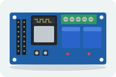
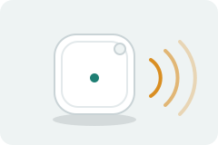
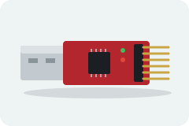
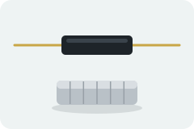
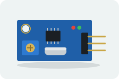
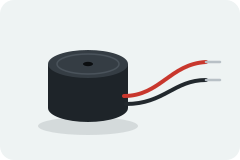

# Hardware

What to buy, and why.

---

## Bill of materials

  
  
  

| Part | Cost | Notes |
|---|---|---|
| ESP32 board with 2 relays on-board | $15–20 | **Simplest option.** Relays and ESP32 on one PCB, no inter-wiring, polarity already correct. Usually has no USB socket. [Wiring diagram](WIRING.md#the-all-in-one-board-the-reference-build) |
| *or* separate ESP32 + relay module | $8 + $6 | More flexible, more ways to get the ground and polarity wrong |
| USB-to-TTL adapter (CP2102) | $8–10 | Needed for any board without a USB socket |
| BLE beacon | $10–15 | Must advertise a **fixed** address. See below |
| Door motor + controller | Whatever your coop door already uses. |
| 5 V supply | Sized for the ESP32 *and* both relay coils. 1 A minimum. |
| LED + 220 Ω–1 kΩ resistor | Optional; many dev boards have one you can reuse. |
| Weatherproof enclosure | Not optional in a coop. |

### The sensors — optional, and they change what the firmware can know

  
  
  

Every one of these is optional and the door works without them. What they buy is
not features, it is **the difference between the firmware believing something and
knowing it**. Without them the door is open-loop: it pulses a relay and assumes.

| Part | Cost | Pin on the reference build | What it buys |
|---|---|---|---|
| 2 × reed switch + magnet ([WOWOONE 5-pack with magnets](https://www.amazon.com/dp/B08K36VLZ2) — on the reference door, [Cylewet N/O 10-pack](https://www.amazon.com/Cylewet-Normally-Magnetic-Induction-Electromagnetic/dp/B01NBPDU04), [DIYables door-sensor modules](https://www.amazon.com/DIYables-Magnetic-Arduino-ESP8266-Raspberry/dp/B0B3D7BM4K)) | ~$8 / pack | **32** open, **25** closed | "Did it *arrive*." Turns every assumption into a measurement: a stalled close is detected and reversed, a stale belief is corrected, and a door moved by hand is noticed |
| Vibration sensor, SW-420 ([5-pack](https://www.amazon.com/dp/B0FC5PW8CK) — on the reference door, [Hiletgo 5-pack](https://www.amazon.com/Hiletgo-SW-420-Vibration-Sensor-Arduino/dp/B00HJ6ACY2), [DIYables LM393](https://www.amazon.com/DIYables-Vibration-Normally-Digital-Raspberry/dp/B0H2915KFF)) | ~$7 / pack | **33** | "Did it *start*." Answers in about a second where a reed takes the full travel, which is what makes the swallowed wake press detectable rather than guessed at |
| Passive piezo buzzer ([3-pin module](https://www.amazon.com/Passive-Buzzer-Arduino-3-3V-5V-Interface/dp/B07KNV8KVJ), [bare 9 × 4.2 mm](https://www.amazon.com/Passive-Buzzer-94-2mm-9x4-2mm-Buzzers/dp/B0BBR6TRYG)) | ~$1–8 | **27** | The only interface at the door. Ticks while travelling, chimes on arrival, and sounds a distinct pattern for a lockout, a schedule refusal and a failed sensor — the difference between "nothing is happening" and "it is working, wait" |

Prices are indicative, as of **October 2026**, and all three are sold in
multi-packs — you need two reeds, one vibration module and one buzzer, so one pack
of each leaves spares. Links are to parts matching the reference build; any
equivalent works and **none of the pins above are compiled in** — they are set at
runtime with `sensors`, `vibration` and `buzzer` on the console and saved on the
device.

**Three specifications that actually matter:**

**The reeds must CLOSE when the magnet is near** — normally-open, not
normally-closed. The firmware drives them `INPUT_PULLUP` and reads active-LOW, so
the switch pulls the pin to ground to say "the door is at this end". An N/C part
reads exactly backwards and the door will believe it is open when it is shut. Many
listings sell both in one pack; check which you wired.

**The buzzer must be PASSIVE, not active.** A passive buzzer is a speaker and
needs a driving square wave, which is what lets the firmware play different
patterns for different events. An active buzzer contains its own oscillator and
can only make one note, so every message sounds the same. `chime.cpp` detects
which it is at runtime and degrades to single beeps on an active one, so a wrong
part is not fatal — just mute in the way that matters.

**Mount the vibration sensor ON THE DOOR, not on the controller board.** A sensor
bolted beside the relay hears the *relay*, on every actuation, whether or not the
door moved — which is precisely the signal it exists to distinguish from movement.
There is a blanking window after each pulse, but blanking cannot rescue a sensor
sitting on top of the thing making the noise. The SW-420's sensitivity screw also
wants backing off until `s` reports **0 edges at rest**; the firmware raises a
`SENSOR_FAULT` if it chatters, because a sensor firing at idle makes the wake probe
suppress the real press.

---

**About $80 for a complete build** including a basic automatic door. The
electronics alone — ESP32-with-relays board plus a USB-to-TTL adapter — come to
roughly **$25–30**; the full sensor suite adds about **$16** on top of that, and
the door is the rest.

Spending more is worth it on the door, not the electronics: $80–180 buys
anti-pinch, which is the only obstruction protection in the system. **The sensors
are the next best value after that** — they cost about as much as a takeaway and
they are what turn a door that assumes into a door that reports, including the one
failure that matters most: a close that stalled on something soft.

---

## The ESP32 board

**Recommended: a classic ESP32 WROOM-32 dev board.** They are cheap,
universally available, extremely well documented, and the reference build uses
one.

Any board with the ESP32 Arduino core 3.x support will work. Note:

- **This firmware uses NimBLE on every chip**, so there is nothing to choose.
  It is one library — see
  [ESP32-PRIMER.md](ESP32-PRIMER.md#the-one-library-you-must-install).
  (We used the core's Bluedroid stack until it ran a door out of heap and
  panicked it three times in a row.)

The firmware builds on both stacks, and deliberately only uses BLE APIs common
to the two. If you contribute code here, keep it that way.

**ESP32-S2 will not work** — it has no Bluetooth radio at all. This catches
people out because the board looks identical to an S3.

### Antenna

The PCB trace antenna on a standard WROOM module is fine for this. What matters
much more is placement:

- Keep it **away from metal**. A metal enclosure is a Faraday cage; a metal roof
  30 cm away will reflect and null in ways that make your tuning meaningless.
- Keep the antenna end of the module **clear of the enclosure wall** and of the
  power supply.
- Mount it in its final position **before** tuning. See
  [TUNING.md](TUNING.md).

An external-antenna variant (U.FL connector) buys you range and a stable mount
point if the electronics have to live somewhere awkward. It is a nice upgrade,
not a requirement.

### Flash and partitions

**The default partition scheme is not used, and will not fit.** With WiFi enabled
the image does not come close — it needs about 136% of it. Build with
**`min_spiffs`** (Arduino IDE: Tools → Partition Scheme → *Minimal SPIFFS (1.9MB
APP with OTA/190KB SPIFFS)*); PlatformIO picks it up from `board_build.partitions`
in `platformio.ini`.

`min_spiffs` is required rather than merely roomier, for a second reason: it keeps
a **second app slot**, which is what over-the-air updates need. A mounted door is
updated over WiFi, so losing that slot would mean a ladder.

Measured on a classic ESP32, 6 Oct 2026, of the 1.875 MB `min_spiffs` app
partition:

| Build | Flash | |
|---|---|---|
| default (NimBLE + WiFi) | **1,395,443** | **70%** |
| `-DPETDOOR_USE_NIMBLE=0` (Bluedroid) | 1,852,523 | 94% |
| `-DPETDOOR_ENABLE_WIFI=0` | 718,039 | 36% |

A 4 MB board is the norm and is plenty. Bluedroid has only ~114 KB spare and is
the configuration that will run out first.

---

## The beacon

**This is the part people get wrong, so it is worth being precise.**

You need a BLE device that advertises a **fixed, non-rotating Bluetooth
address**, continuously, forever, on battery.

### What will not work

- **A phone.** iOS and Android both randomise their BLE address every 15 minutes
  or so. This is a deliberate anti-tracking measure and you cannot switch it off.
- **An Apple AirTag.** Same reason, more aggressively. AirTags are *designed* to
  be untrackable by third parties. The firmware will happily show you one in the
  discovery table, labelled `AirTag`, and its MAC will be different next time you
  look.
- **A Tile, a Chipolo, most smartwatches, most fitness bands.** Same story.
- **Anything that sleeps.** A device that advertises only when you press a
  button gives you no sample stream.

If your "beacon" changes MAC, proximity will appear to work for a few minutes
after each reflash and then silently stop. That symptom is almost always this.

### Measured: why an AirTag fails twice over

Both failures were confirmed on hardware, and either alone rules it out.

**Address rotation.** One AirTag observed for under two hours produced **four
distinct addresses**, none of them overlapping. Nothing to configure against.

**Advertising rate.** With the AirTag **two feet** from the ESP32 — its
best-case signal:

| | shortest | typical | longest |
|---|---|---|---|
| AirTag at 2 ft | 965 ms | 5,140 ms | 17,865 ms |
| Minew beacon, further away | 72 ms | 349 ms | 885 ms |

The typical AirTag gap already exceeds `SAMPLE_MAX_AGE_MS` (3 s), so it reads as
absent most of the time even at point-blank range. Its worst gap exceeds
`EXIT_CONFIRM_MS`, so the door would close while the tag sat beside it.

Use the `worst gap` figure in the `s` status output to check any candidate
beacon the same way.

### What will work

A purpose-built BLE beacon. The reference build uses a
**[Minew](https://www.minew.com/)** beacon — the MST01 is a common, cheap,
coin-cell-powered tag with a fixed public address.

Other good options:

- Any iBeacon-format tag from a beacon vendor (Estimote, Kontakt.io, Blue Charm,
  generic AliExpress "iBeacon" tags).
- An Eddystone beacon — the firmware will see and classify it; match on MAC.
- **A second ESP32** running an iBeacon advertiser sketch. Cheap, totally under
  your control, and easy to give a known fixed address — but it needs power, so
  this suits a fixed installation rather than something on a collar.
- An nRF51/nRF52 dongle flashed with beacon firmware.

The firmware does not care about the beacon's format when matching by MAC. It
only parses iBeacon frames to extract the **calibrated transmit power** (for the
displayed distance estimate) and the **UUID/major/minor** (if you match on
those).

### Beacon settings that matter

| Setting | Recommendation |
|---|---|
| **Advertising interval** | 100–300 ms. Faster gives a better sample stream and a more responsive door; slower saves battery. |
| **Transmit power** | Start at the middle of the range. Higher = longer range but a flatter RSSI curve near the door, which makes tuning *harder*. |
| **Format** | iBeacon, if you want the distance estimate to display. Otherwise irrelevant. |

There is a real trade-off between advertising interval and battery life: a
coin-cell beacon at 100 ms might last months, where at 1000 ms it lasts a year
or more. Given the median filter wants a steady stream, err toward the faster
end and plan on changing batteries.

### Mounting the beacon

**On a collar is the normal case**, and what this project is tuned for. A small
BLE tag on a dog or cat collar sits at roughly the right height, moves with the
animal, and is easy to replace. Most beacon tags have a lanyard hole; a cable
tie or a small keyring loop through the collar is enough.

Two things to get right:

- **Height matters more than you expect.** A beacon at ankle height on a small
  dog reads several dB weaker than the same beacon held at chest height, and
  the animal's body between beacon and ESP32 costs several more. Tune with the
  beacon **on the animal**, not in your hand — see [TUNING.md](TUNING.md).
- **Orientation changes constantly.** That is normal and is exactly what the
  median filter and dwell timers absorb.

For a chicken, a leg band or a small pouch on a saddle works, but it is fiddly
and birds are good at removing things. Consider whether one beacon on the bird
that is reliably last in is enough.

### General mounting notes

- On a collar or leg band, the beacon's orientation changes constantly, and a
  body between the beacon and the ESP32 costs several dB. This is normal and is
  what the filter and the dwell timers absorb.
- **Waterproof it.** Coops are wet. Most beacon tags are splash-resistant at
  best.
- Have a spare. If you match on iBeacon UUID rather than MAC, you can program
  the spare with the same identity and swap it in without reflashing the ESP32.

See [BEACON-SETUP.md](BEACON-SETUP.md) for configuring one and finding its
address.

---

## The relay module

A standard **2-channel 5 V relay module** is what most builds use.

Things to check before buying:

- **Contact rating** must exceed your motor's stall current, not its running
  current. A motor draws several times its running current at startup and when
  stalled.
- **Opto-isolation** on the input is worth having, especially with a mains load.
- **Coil voltage** must match your supply — a 5 V module on a 3.3 V rail will
  click unreliably or not at all.
- Most cheap blue relay boards are **active low**. The firmware defaults to
  active high. See [WIRING.md](WIRING.md#the-active-high-vs-active-low-trap) —
  this is the single most common wiring mistake in this project.

### Alternatives to relays

- **Logic-level MOSFET modules** — silent, faster, no contacts to weld, but
  low-side switching only and DC only. Excellent for a 12 V linear actuator.
- **Solid-state relays (SSRs)** — silent and long-lived, but leak a little
  current when off, which some motor controllers dislike.

Both are active-high, so leave `RELAY_ACTIVE_LOW` at `0`.

---

## The door mechanism

**This is the safety-critical choice, and it is covered in
[SAFETY.md](SAFETY.md). Read that before buying anything.** The short version:

- **Best:** a commercial coop-door kit with its own limit switches and current
  limit, exposing momentary OPEN and CLOSE inputs. PetDoor just presses the
  buttons. This is the design the firmware assumes.
- **Good:** a 12 V linear actuator with built-in end stops.
- **Avoid:** a heavy guillotine door on a direct drive with no obstruction
  detection.

---

## Power

- A 5 V 1 A USB phone charger into the dev board's USB port is the usual
  arrangement.
- Feeding 5 V into `VIN` instead is more robust against a marginal USB
  connector.
- **Never** feed 5 V into the `3V3` pin — that bypasses the regulator and
  destroys the board.
- If your coop's power is unreliable, a small UPS or a battery-backed supply
  avoids exercising the boot-grace path every evening. The firmware handles
  power loss safely, but a door that reboots at dusk is still an annoyance.

---

## Environment

A coop is one of the harsher places you can put electronics: damp, dusty,
ammonia-laden, and occupied by animals that peck at things.

- Sealed enclosure, cable entry **pointing down**.
- Add a desiccant pack, and consider conformal coating in a wet climate.
- Mount it where a bird cannot reach it and a rodent cannot chew the cable.
- Check the operating temperature range if you are somewhere that freezes.
  The ESP32 itself is rated to −40 °C; batteries and LCDs are not, and coin
  cells lose a lot of capacity in the cold — which shows up as a beacon that
  stops being heard on winter nights.
