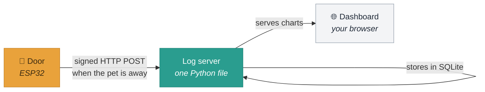
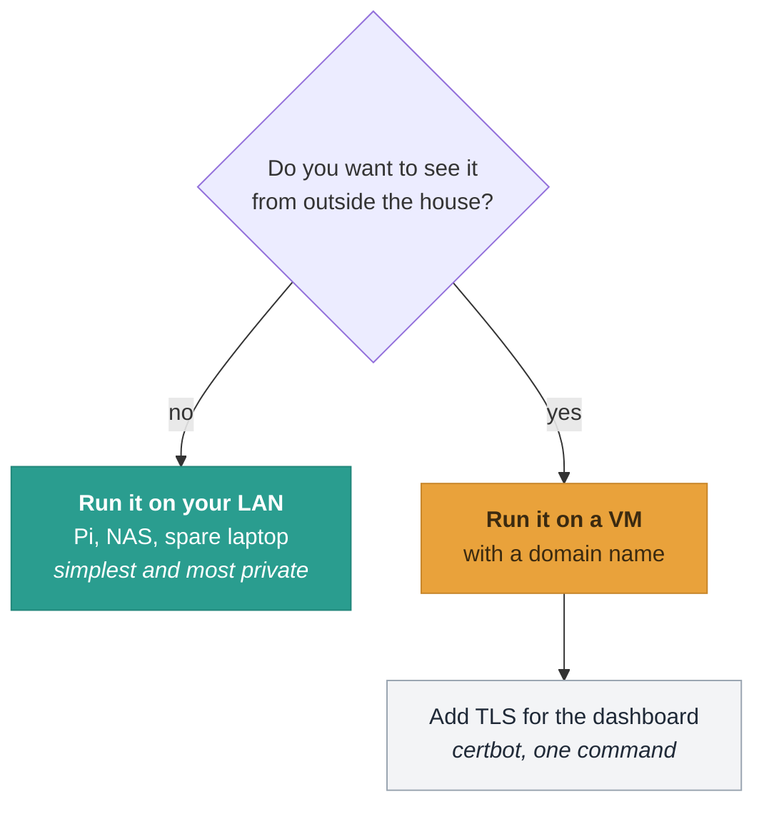
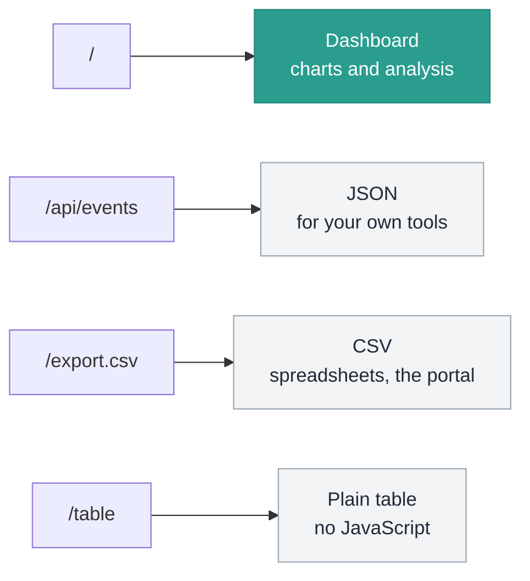

# Running the dashboard on your own server

**Entirely optional.** Your door works, and keeps its own log, whether or not
any of this exists. This page is for when you want a web page you can open from
the sofa instead of plugging in a serial cable.

Everything here runs equally well on a Raspberry Pi on your desk or a VM on the
internet. Nothing is tied to a hosting provider, and there is no cloud account.

---

## How the pieces fit



Three parts, and you can stop after any of them:

| Part | What it is | Where it runs |
|---|---|---|
| **The door** | Records events to its own memory | Always. No network needed |
| **The log server** | Receives, stores, and serves the dashboard | A machine that stays on |
| **The dashboard** | Charts in a browser | Served by the log server |

---

## Choose where it runs



**On your LAN** is the better default. The data never leaves your house, there
is nothing exposed to the internet, and there is no certificate to renew.
Anything always-on will do — a Pi Zero is more than enough.

**On a public VM** if you want it from anywhere. You then need a domain name
pointing at the machine, and TLS for the dashboard.

---

## 1. Deploy it

One command, and it is the same whichever you chose:

```bash
cd tools/logserver

./deploy.sh pi@raspberrypi.local              # LAN, port 8080
./deploy.sh you@vm.example.com petdoor.example.com   # public, with nginx
```

It checks it can log in, copies two files, writes a `systemd` unit, starts the
service, and prints the shared key your door needs. **Re-running it upgrades in
place** and never touches the database or rotates the key.

What it needs on the far end: SSH key access, `python3`, `systemd`, and `sudo`.
Nothing else — no pip, no Docker, no package installs.

<details>
<summary>What if I would rather not run a script against my server?</summary>

Copy two files and run one command:

```bash
scp tools/logserver/petdoor-logserver.py tools/logserver/dashboard.html you@host:~/
ssh you@host
python3 petdoor-logserver.py --init      # prints the shared key
python3 petdoor-logserver.py --port 8080
```

That is the whole thing. `deploy.sh` only adds the `systemd` unit so it comes
back after a reboot, and the nginx vhost if you gave it a domain.
</details>

### If you gave it a domain

The DNS record has to exist **before** you deploy, or nginx has nothing to
answer for and certbot cannot verify you own it:

```
petdoor.example.com.   A   198.51.100.10
```

Then, optionally, TLS for the dashboard:

```bash
ssh you@host sudo certbot --nginx -d petdoor.example.com
```

---

## 2. Point the door at it

The deploy script prints these. Put them in `petdoor/secrets.h`, which is
git-ignored:

```c
#define WIFI_SSID        "your-network"
#define WIFI_PASSWORD    "your-password"
#define LOG_ENDPOINT_URL "http://petdoor.example.com/ingest"
#define LOG_SHARED_KEY   "4f8a1c9e2b7d3056a1e8f4c2d9b06537"
#define LOG_DEVICE_ID    "back-door"          // optional, if you have several
```

Reflash, then press `u` in the serial console to force an upload rather than
waiting for the door to find an idle moment:

```
[wifi] radio up — BLE sampling is degraded until this finishes
[wifi] uploaded 14 events, clock synced
[wifi] radio down
```

Open the dashboard and the events are there.

### Why the door uses plain HTTP even when you have TLS

Deliberate, and the nginx config above keeps `/ingest` on port 80 for exactly
this reason.

The door signs every upload with **HMAC-SHA256** over your shared key. The key
is never transmitted, so nobody can forge events or replay an old batch. What
TLS would add is hiding the contents — at a cost the ESP32 pays badly:

| | HTTP + HMAC | HTTPS |
|---|---|---|
| Extra radio time per upload | ~0 | **1–3 s handshake** |
| Extra heap | ~0 | ~40 KB |
| Forgeable by an attacker | no | no |
| Readable by a network sniffer | yes | no |

**Radio time is the one resource the door cannot spare** — the same antenna
hears the beacon, so every second spent on WiFi is a second not spent detecting
your pet. Put TLS in front of the *dashboard*, where a browser pays for it, and
leave the door speaking HTTP to nginx.

---

## 3. Read it



The dashboard shows daily rhythm, how long your pet stays out, trips per day,
time of day, and a beacon-signal trend that warns of a flat battery before it
starts missing. It refreshes itself once a minute, which is plenty — the door
uploads in bursts, not continuously.

---

## Managing the shared key

```bash
ssh you@host
cd /opt/petdoor
python3 petdoor-logserver.py --show-key      # what the door should be using
python3 petdoor-logserver.py --rotate-key    # issue a new one
python3 petdoor-logserver.py --no-key        # accept unsigned uploads
```

**Rotating takes effect immediately.** The door's next upload is rejected until
you reflash it with the new key — deliberately, since a key you could change
without touching the door would not be worth much. The door says so plainly:

```
[wifi] upload REJECTED (HTTP 401) — the server did not accept our signature.
[wifi] events are kept locally and will be retried
```

Nothing is lost meanwhile. Events stay in the door's ring and go up once the key
matches, as long as you fix it before 128 newer events push them out.

---

## When it does not work

| Symptom | Where to look |
|---|---|
| Dashboard says "could not reach the log server" | `sudo systemctl status petdoor-log` |
| Door logs `HTTP 401` | Key mismatch — compare `--show-key` with `secrets.h` |
| Door logs `HTTP 404` | The URL must end in `/ingest` |
| Door logs `endpoint unreachable` | Firewall, wrong IP, or nginx not proxying |
| Door logs `could not associate` | WiFi credentials or signal, not the server |
| Dashboard is empty but ingest returns 200 | Events arrived with no clock; check the plain `/table` view |

On the server:

```bash
sudo journalctl -u petdoor-log -f      # live, including rejected uploads
```

A rejected upload is logged with the reason, so a key mismatch is visible from
both ends.

---

## Privacy

Door events say when somebody is coming and going from your house. On a LAN that
stays between your devices. If you publish it, put it behind TLS and consider
whether it should be reachable without a login at all — nginx `auth_basic` is
two lines, and the [nginx docs] cover it.

The log server itself has no accounts and no login: it assumes whoever can reach
it is allowed to read it. That is fine on a home network and is the reason the
LAN option is the recommended one.

[nginx docs]: https://docs.nginx.com/nginx/admin-guide/security-controls/configuring-http-basic-authentication/
