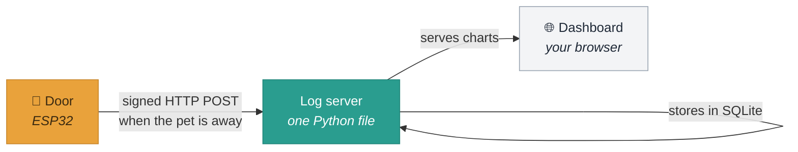
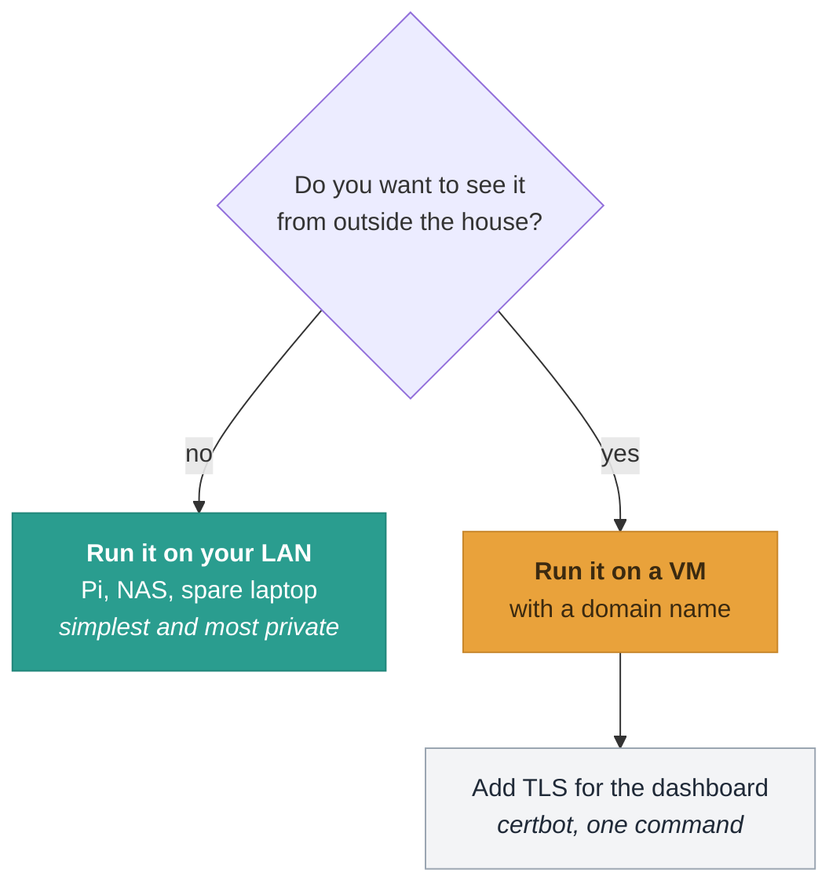
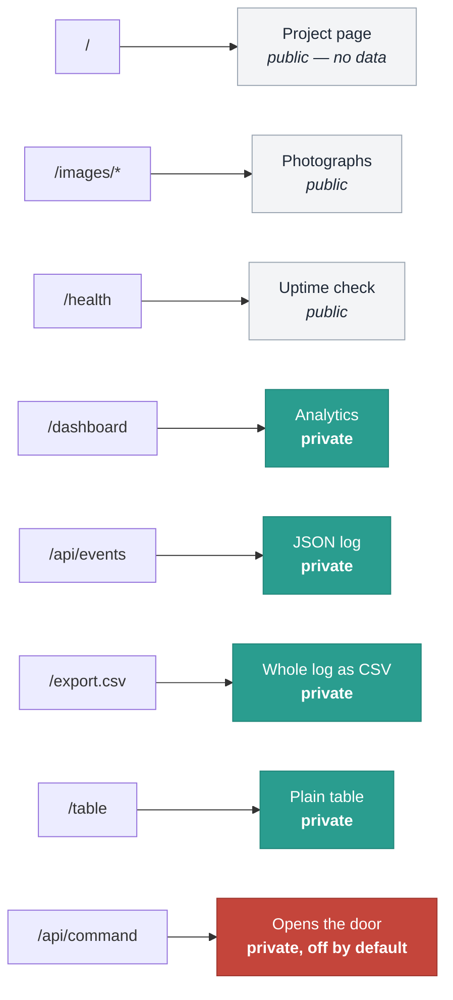
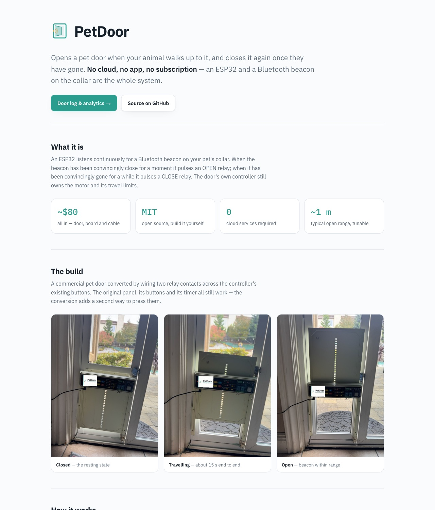
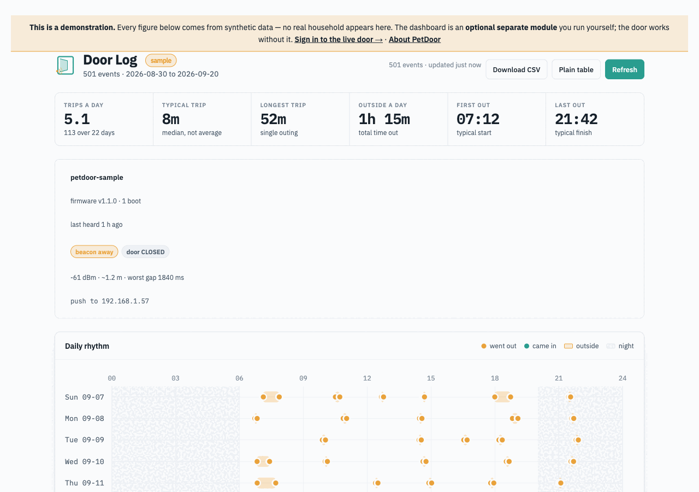
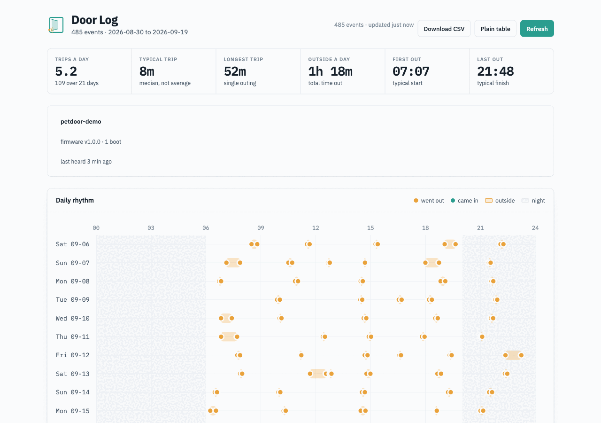
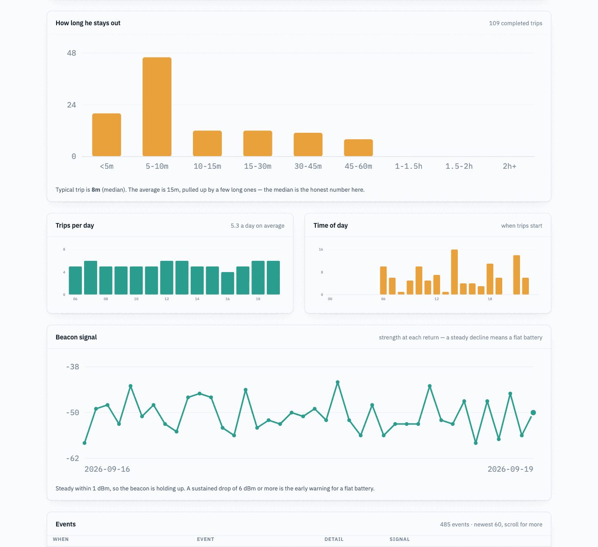
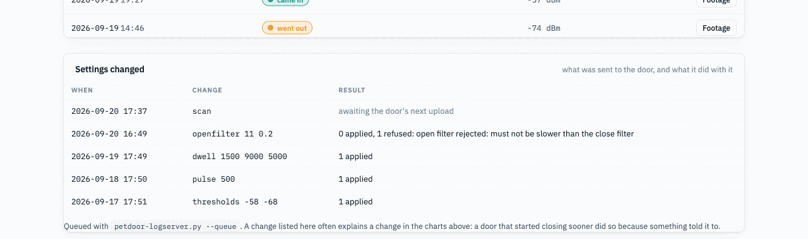

# Running the dashboard on your own server

**Entirely optional.** Your door works, and keeps its own log, whether or not
any of this exists. This page is for when you want a web page you can open from
the sofa instead of plugging in a serial cable.

Everything here runs equally well on a Raspberry Pi on your desk or a VM on the
internet. Nothing is tied to a hosting provider, and there is no cloud account.

---

## How the pieces fit



Three parts, and you can stop after any of them:

| Part | What it is | Where it runs |
|---|---|---|
| **The door** | Records events to its own memory | Always. No network needed |
| **The log server** | Receives, stores, and serves the dashboard | A machine that stays on |
| **The dashboard** | Charts in a browser | Served by the log server |

---

## Choose where it runs



**On your LAN** is the better default. The data never leaves your house, there
is nothing exposed to the internet, and there is no certificate to renew.
Anything always-on will do — a Pi Zero is more than enough.

**On a public VM** if you want it from anywhere. You then need a domain name
pointing at the machine, and TLS for the dashboard.

---

## 1. Deploy it

One command, and it is the same whichever you chose:

```bash
cd tools/logserver

./deploy.sh pi@raspberrypi.local              # LAN, port 8080
./deploy.sh you@vm.example.com petdoor.example.com   # public, with nginx
```

It checks it can log in, copies two files, writes a `systemd` unit, starts the
service, and prints the shared key your door needs. **Re-running it upgrades in
place** and never touches the database or rotates the key.

What it needs on the far end: SSH key access, `python3`, `systemd`, and `sudo`.
Nothing else — no pip, no Docker, no package installs.

<details>
<summary>What if I would rather not run a script against my server?</summary>

Copy two files and run one command:

```bash
scp tools/logserver/petdoor-logserver.py tools/logserver/dashboard.html you@host:~/
ssh you@host
python3 petdoor-logserver.py --init      # prints the shared key
python3 petdoor-logserver.py --port 8080
```

That is the whole thing. `deploy.sh` only adds the `systemd` unit so it comes
back after a reboot, and the nginx vhost if you gave it a domain.
</details>

### If you gave it a domain

The DNS record has to exist **before** you deploy, or nginx has nothing to
answer for and certbot cannot verify you own it:

```
petdoor.example.com.   A   198.51.100.10
```

Then, optionally, TLS for the dashboard:

```bash
ssh you@host sudo certbot --nginx -d petdoor.example.com
```

---

## 2. Point the door at it

The deploy script prints these. Put them in `petdoor/secrets.h`, which is
git-ignored:

```c
#define WIFI_SSID        "your-network"
#define WIFI_PASSWORD    "your-password"
#define LOG_ENDPOINT_URL "http://petdoor.example.com/ingest"
#define LOG_SHARED_KEY   "4f8a1c9e2b7d3056a1e8f4c2d9b06537"
#define LOG_DEVICE_ID    "back-door"          // optional, if you have several
```

Reflash, then press `u` in the serial console to force an upload rather than
waiting for the door to find an idle moment:

```
[wifi] radio up — BLE sampling is degraded until this finishes
[wifi] uploaded 14 events, clock synced
[wifi] radio down
```

Open the dashboard and the events are there.

### Why the door uses plain HTTP even when you have TLS

Deliberate, and the nginx config above keeps `/ingest` on port 80 for exactly
this reason.

The door signs every upload with **HMAC-SHA256** over your shared key. The key
is never transmitted, so nobody can forge events or replay an old batch. What
TLS would add is hiding the contents — at a cost the ESP32 pays badly:

| | HTTP + HMAC | HTTPS |
|---|---|---|
| Extra radio time per upload | ~0 | **1–3 s handshake** |
| Extra heap | ~0 | ~40 KB |
| Forgeable by an attacker | no | no |
| Readable by a network sniffer | yes | no |

**Radio time is the one resource the door cannot spare** — the same antenna
hears the beacon, so every second spent on WiFi is a second not spent detecting
your pet. Put TLS in front of the *dashboard*, where a browser pays for it, and
leave the door speaking HTTP to nginx.

---

## 3. Read it

The server splits its routes into a **public** half and a **private** half, so
a reverse proxy can protect the part that matters without hiding the project
entirely.



**Why bother splitting it.** A door log is a record of when somebody is home.
Trips per day, first out, last out and the daily-rhythm strip together describe
a household's routine precisely enough to tell a stranger when the house is
reliably empty. That is worth a login. The project page is not.

**The server does no authentication itself** — it is 400 lines of stdlib Python
and has no business holding credentials. It only arranges the routes so your
proxy can. See [protecting the private routes](#protecting-the-private-routes).

### The public page

<p align="center">
  
</p>

Served at `/`. It explains what the door is, shows the build, and links to the
analytics behind sign-in. No event data of any kind reaches it.

### The sample dashboard

<p align="center">
  
</p>

Served at `/demo`, and **public**. The sample data is baked into the page, so it
never touches `/api/events` — there is no route from the demo to any real log.
It exists so somebody deciding whether to build one of these can see what they
would get, without you having to expose your own household to show them.

Regenerate it whenever the dashboard changes, so the two do not drift:

```bash
tools/logserver/make-demo.py        # rebuilds demo.html from dashboard.html
```

### The analytics

<p align="center">
  
</p>

Six numbers across the top, then the **daily rhythm** — one row per day, every
trip drawn in place, night shaded. The pattern is the point: you can see the
routine, and you can see the day it changed.

<p align="center">
  
</p>

Then how long the trips actually are, how many per day, which hours are busy,
and a **beacon-signal trend** — the strength at each return. A steady decline
there is a flat battery, weeks before the door starts missing.

### What the door says about itself

The panel under the headline figures is the door's own report, refreshed with
every upload:

```
  petdoor-sample
  firmware v1.1.0 · 1 boot · last heard 1 h ago
  [beacon away]  [door CLOSED]
  -61 dBm · ~1.2 m · worst gap 1840 ms
  push to 192.168.1.57
```

This is the `s` console output, for a door nobody can plug into. It also flags
what is wrong rather than leaving you to spot it — free heap running low, a
worst gap past the three-second fix timeout, or firmware too old to accept
commands at all. And it gives you the address to push an update to, which the
server cannot work out for itself: behind a reverse proxy it only ever sees the
proxy.

### Settings changed

<p align="center">
  
</p>

Every remote configuration change, with what the door made of it — including
refusals, in the door's own words.

It sits on the same page as the charts deliberately. A door that started closing
sooner, or stopped opening reliably, usually did so **because something told it
to**, and having the change log beside the behaviour turns "what happened on the
14th?" into a question you can answer by looking.

> The screenshots above are generated from synthetic data, not from a real
> household. That is deliberate: they are in a public repository, and the whole
> reason the analytics sit behind a login is that this data describes when a
> house is empty.

**Times are shown in the viewer's local timezone.** The door uploads UTC and the
server stores UTC; only the display is local. Every chart here answers a
question about a human day, and a UTC day is the wrong day for anyone who does
not live on one — at UTC-7 an evening outing at 18:38 would otherwise report as
"01:38" and land on the following row.

The dashboard shows daily rhythm, how long your pet stays out, trips per day,
time of day, and a beacon-signal trend that warns of a flat battery before it
starts missing.

Across the top it also lists each door with **the firmware it is running, how
many times it has rebooted, and when it last called in**. That row is the
health check: a reboot count climbing between uploads is a power problem, and a
door that has not been heard from in hours is off, off the network, or failing
to upload. It says so rather than leaving you to notice. It refreshes itself once a minute, which is plenty — the door
uploads in bursts, not continuously.

---

## Controlling the door from the browser

**Off by default.** Start the server with `--allow-web-control` (or set
`PETDOOR_WEB_CONTROL=1`) and the dashboard grows a control panel: open, close,
hand back to the collar, lock, unlock, and a beep to prove the door is awake.

```bash
python3 petdoor-logserver.py --allow-web-control
```

Without the flag the panel does not render and `POST /api/command` returns 403.
That default is deliberate. An existing install whose private routes are
protected by nothing but an unguessable hostname must not silently acquire a
button that opens the door; turning this on should be a decision somebody took.

> **Read [protecting the private routes](#protecting-the-private-routes) before
> you turn it on.** `/api/command` is matched by the same `/api/*` rule as the
> rest — so if you followed those instructions you are already covered — but
> the consequence of getting it wrong changes completely. An unprotected
> `/api/events` leaks your household routine. An unprotected `/api/command`
> lets a stranger open your door.

### Two panels, because there are two kinds of change

**Control** is the one-tap half, on the Controls tab:

| Button | Sends | Notes |
|---|---|---|
| Open / Close | `door open` / `door close` | One press of the controller's button |
| Auto | `door auto` | Clears a manual hold, handing control back to the collar |
| Lock / Unlock | `lock` / `unlock` | Stops the collar opening the door. Does **not** stop an open door closing |
| Beep | `beep` | Sounds the buzzer. A cheap "is it alive" that touches nothing |

**Settings** is everything you would otherwise tune over a serial cable. It
lives on its own tab, and holds typed fields with ranges rather than buttons —
because a threshold is a value you consider, not something you tap by accident:

| Group | Fields | Command |
|---|---|---|
| Detection | open / close threshold, dBm | `thresholds` |
| | close filter: median window, smoothing | `filter` |
| | open filter: median window, smoothing | `openfilter` |
| Timing | open dwell, close dwell, minimum interval | `dwell` |
| | door travel time | `travel` |
| Relay | pulse length | `pulse` |
| | presses per actuation, and the gap | `presses` |
| | interlock dead time | `gap` |
| Buzzer | GPIO pin, active/passive, polarity | `buzzer` |
| Limit switches | open-end pin, closed-end pin, polarity | `sensors` |
| Calling in | settle, minimum interval, heartbeat | `upload` |
| Maintenance | upload a beacon scan | `scan` |
| | reset statistics | `resetstats` |
| | open an OTA window | `ota` **(asks first)** |
| | restart the door | `reboot` **(asks first)** |
| | revert every stored setting | `defaults` **(asks first)** |
| | change the beacon list | `macs` **(asks first)** |

Only the credentials are off limits — `wifi`, the endpoint, the shared key and
the OTA password. Those are the channel the command itself travels over, and
changing one remotely is how a door stops being reachable with no way back but
a ladder. The firmware refuses them, and so does the server.

### How the page is laid out

The banner carries the three facts you look for first — **firmware version**,
**event count**, and **when the door last called in**. That last one turns amber
past three hours, because a door that has gone quiet is a door to walk out and
look at, and that should not be something you have to scroll to find.

Under it sits the door's live status, then three tabs:

| Tab | Holds |
|---|---|
| **Activity** | The charts, the event log and the cameras. Its own second-level menu carries **Download CSV** and **Plain table** |
| **Controls** | The buttons, and the **controls log** — what was asked of the door and what it did |
| **Settings** | The form, and the **settings log** — what was changed and what the door made of it |

The two logs used to be one table called "Settings changed". Splitting them
follows what the commands actually do: asking the door to open is a thing you
did to it today, retuning its exit threshold changes how it behaves from now on.
One belongs beside the buttons, the other beside the form.

The tab you last used is remembered in that browser. With `--allow-web-control`
off, the **Settings** tab is not rendered at all and the **Controls** tab keeps
only its log — which is still worth reading, since commands queued from the
command line appear there either way.

### The form shows what the door is actually set to

Each field is filled from the door's own report, not from what was last queued.
The door sends its full configuration with every upload, so the boxes show the
values in force right now — and if you change one, the box keeps showing the
old value until the door confirms the new one, because until then the old value
*is* what is in force.

A door that has not reported yet — one still running older firmware, or one
that has not called in since this server was updated — gets a banner saying so,
and the fields fall back to greyed placeholder defaults rather than pretending.

> **The form never redraws under your fingers.** The page polls every minute,
> but the settings only re-render when the door itself reports something
> different. Otherwise a half-finished edit would be wiped by a background
> refresh, and the box you just changed would snap back to the old value —
> which reads as "it didn't work", and gets pressed again.

### Validation happens twice, on purpose

The server checks every value against the same ranges the firmware enforces —
`pulse` 50–10000 ms, an odd median window, the open threshold above the close
one, the minimum interval below the close dwell — and refuses out-of-range
input immediately, naming the range.

The firmware then checks it all again, because it has to: anyone can run a
server, so the door cannot trust one. The duplication buys you the difference
between being told *now* and being told in five minutes' time when the door
next calls in. That difference is most of what tuning a door remotely feels
like.

### Nothing here is instant

A command is **queued**, not sent. The door has no open connection to the
server — it calls in, opportunistically, when the collar is away, which is
usually within about five minutes. Only then does it collect what is waiting.

So the panel never pretends. A press moves the command into a visible
**Waiting for the door** list and it stays there until the door has actually
taken it, at which point it appears in *Settings changed* with the door's own
verdict on it.

That delay is also the safety net: while a command is still waiting, **Cancel**
recalls it. That is why there is no confirmation dialog on every press — a
confirm adds friction to the one thing people actually want, which is to open
the door from the garden with cold hands, and it does nothing about the press
you regret thirty seconds later.

### Email when something consequential happens

Set `PETDOOR_NOTIFY_TO` and the server mails you when a command with a
consequence is queued — from the dashboard or the command line, either way:

| Mailed | Not mailed |
|---|---|
| `door open`, `lock`, `unlock` | `door close`, `door auto` |
| `defaults`, `macs`, `reboot`, `ota` | every settings change, `beep`, `scan` |

The exclusions are the point. A tuning session is a dozen commands in a minute,
and a mailbox that fills with `pulse 500` is one whose PetDoor mail gets
filtered into a folder nobody opens — at which point the alert that mattered is
lost with the rest. Settings changes are recorded on the Settings tab, they are
reversible, and none of them is a thing happening *at* the door.

`door close` and `door auto` are missing for the same reason the lockout only
gates closing: they are the safe direction.

The message says what was queued, for which door, when, from where, and — when
it came from the dashboard — **which signed-in account asked**, taken from the
identity the proxy passes through rather than anything the caller supplied. It
also mentions that a queued command can still be cancelled, because it can.

SMTP settings come from the environment (`SMTP_HOST`, `SMTP_PORT`, `SMTP_USER`,
`SMTP_PASSWORD`, `SMTP_FROM`, `SMTP_CRYPTO`), deliberately sharing the names a
host's other services already use, so one set of credentials serves all of them
rather than a second copy going stale on its own.

**A relay having a bad afternoon never breaks a command.** The command is
queued before the mail is attempted, the send cannot raise into the caller, and
a failure is written to the server log — because a notification that never
arrives is otherwise indistinguishable from nothing having happened.

> **`SMTP_FROM` is a setting, not a guess.** A default like
> `petdoor@<somedomain>` sends as a domain you may not own, fails SPF and DKIM
> at any real relay, and quietly lands every future alert in spam — precisely
> the failure this feature exists to prevent. With nothing to send as, the
> server refuses and names the missing setting.

### How it is protected from other sites

Your proxy decides *who* you are, with a cookie. But a browser attaches that
cookie to any request to this origin — including one started by a completely
different site you happen to visit. Authentication alone does not prove the
request came from you.

Two checks close that, neither of which a cross-origin page can satisfy:

- **A custom `X-PetDoor-Control` header.** Browsers refuse to send one
  cross-origin without a CORS preflight, and this server answers no preflight,
  so the request is never made.
- **`Origin` must match `Host`** whenever the browser sends an `Origin`.

Every accepted and rejected command is written to the server log with the source
address, so there is a record of who opened the door and when.

---

## Protecting the private routes

The split is only worth anything if something enforces it. The server listens on
localhost; your proxy decides who reaches which path.

Whatever you use, the rule is the same shape:

| Path | Who |
|---|---|
| `/`, `/images/*`, `/health` | anyone |
| `/dashboard`, `/api/*`, `/table`, `/export.csv` | you — `/api/*` **includes `/api/command`, which opens the door** |
| `/ingest` | the door — POST only, HMAC-signed, **never** behind the login |

**`/ingest` must stay outside the login.** The door signs its uploads with the
shared key and cannot complete a browser sign-in flow. Put it behind SSO and
uploads fail silently with a redirect the firmware records as an HTTP error.

### Caddy

```caddyfile
petdoor.example.com {
    # Private: everything derived from the log
    @private path /dashboard* /api/* /table* /export.csv*
    basic_auth @private {
        you $2a$14$...        # caddy hash-password
    }
    reverse_proxy 127.0.0.1:8080
}
```

With an identity provider, replace `basic_auth` with your `forward_auth` block
against the same `@private` matcher — the matcher is the part that matters.

### nginx

```nginx
server {
    server_name petdoor.example.com;

    location ~ ^/(dashboard|api|table|export\.csv) {
        auth_basic           "PetDoor";
        auth_basic_user_file /etc/nginx/petdoor.htpasswd;
        proxy_pass           http://127.0.0.1:8080;
    }

    location / {                       # public page, images, health, ingest
        proxy_pass http://127.0.0.1:8080;
    }
}
```

`htpasswd -c /etc/nginx/petdoor.htpasswd you` creates the password file.

### Apache

```apache
<Location "/dashboard">
    AuthType Basic
    AuthName "PetDoor"
    AuthUserFile /etc/apache2/petdoor.htpasswd
    Require valid-user
</Location>
# repeat for /api, /table, /export.csv
ProxyPass        / http://127.0.0.1:8080/
ProxyPassReverse / http://127.0.0.1:8080/
```

### Checking it

```bash
curl -o /dev/null -w '%{http_code}\n' https://petdoor.example.com/            # 200
curl -o /dev/null -w '%{http_code}\n' https://petdoor.example.com/health      # 200
curl -o /dev/null -w '%{http_code}\n' https://petdoor.example.com/dashboard   # 401
curl -o /dev/null -w '%{http_code}\n' https://petdoor.example.com/api/events  # 401
```

If `/api/events` returns 200 without a credential, your rule is matching the
page but not the data behind it, and the analytics are protected in appearance
only. That is the check worth running after any proxy change.

### If you would rather not publish anything

Put the whole host behind the login. The public page is a convenience, not a
requirement, and nothing in the door depends on it.

---

## Managing a door you can no longer reach

Once the door is installed the serial console is gone, and with it the only way
to open an OTA window or change a threshold. The server's reply to an upload
doubles as a command channel that closes that loop — signed with the same key,
and unable to change the WiFi, endpoint or key it depends on.

```bash
python3 petdoor-logserver.py --queue pulse 500
python3 petdoor-logserver.py --queue ota        # then push firmware
python3 petdoor-logserver.py --commands         # queued / delivered / acknowledged
```

Full command set and the reasoning: **[REMOTE-CONFIG.md](REMOTE-CONFIG.md)**.

---

## Managing the shared key

```bash
ssh you@host
cd /opt/petdoor
python3 petdoor-logserver.py --show-key      # what the door should be using
python3 petdoor-logserver.py --rotate-key    # issue a new one
python3 petdoor-logserver.py --no-key        # accept unsigned uploads
```

**Rotating takes effect immediately.** The door's next upload is rejected until
you reflash it with the new key — deliberately, since a key you could change
without touching the door would not be worth much. The door says so plainly:

```
[wifi] upload REJECTED (HTTP 401) — the server did not accept our signature.
[wifi] events are kept locally and will be retried
```

Nothing is lost meanwhile. Events stay in the door's ring and go up once the key
matches, as long as you fix it before 128 newer events push them out.

---

## When it does not work

| Symptom | Where to look |
|---|---|
| Dashboard says "could not reach the log server" | `sudo systemctl status petdoor-log` |
| Door logs `HTTP 401` | Key mismatch — compare `--show-key` with `secrets.h` |
| Door logs `HTTP 404` | The URL must end in `/ingest` |
| Door logs `endpoint unreachable` | Firewall, wrong IP, or nginx not proxying |
| Door logs `could not associate` | WiFi credentials or signal, not the server |
| Dashboard is empty but ingest returns 200 | Events arrived with no clock; check the plain `/table` view |

On the server:

```bash
sudo journalctl -u petdoor-log -f      # live, including rejected uploads
```

A rejected upload is logged with the reason, so a key mismatch is visible from
both ends.

---

## Privacy

Door events say when somebody is coming and going from your house. On a LAN that
stays between your devices. If you publish it, put it behind TLS and consider
whether it should be reachable without a login at all — nginx `auth_basic` is
two lines, and the [nginx docs] cover it.

The log server itself has no accounts and no login: it assumes whoever can reach
it is allowed to read it. That is fine on a home network and is the reason the
LAN option is the recommended one.

[nginx docs]: https://docs.nginx.com/nginx/admin-guide/security-controls/configuring-http-basic-authentication/
