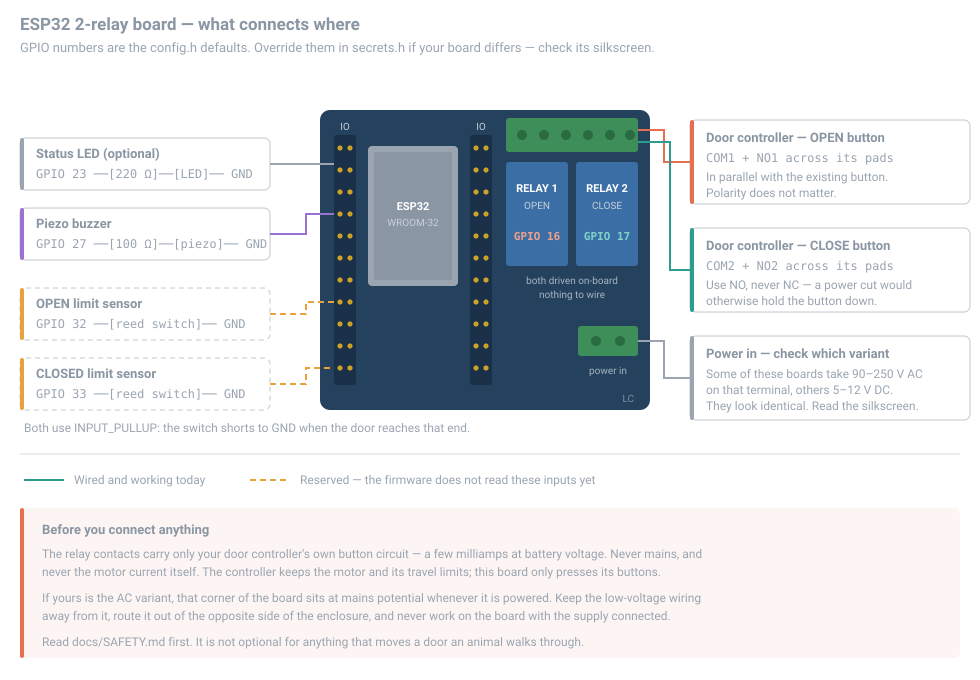

# Wiring

Read [SAFETY.md](SAFETY.md) first. This page assumes you have, and that you
have chosen a door mechanism that fails safe.

---

## Default pinout

Set in [`petdoor/config.h`](../petdoor/config.h). Override in `secrets.h`
rather than editing `config.h`, so `git pull` does not clobber your build.

| Signal | GPIO | Config | Notes |
|---|---|---|---|
| OPEN relay | 16 | `PIN_RELAY_OPEN` | Momentary pulse, `RELAY_PULSE_MS` |
| CLOSE relay | 17 | `PIN_RELAY_CLOSE` | Momentary pulse |
| Status LED | 23 | `PIN_STATUS_LED` | Active high, series resistor required |
| Buzzer | — | `PIN_BUZZER` | Optional annunciator, disabled (`-1`) by default. See [below](#the-annunciator) |
| OPEN limit switch | — | `PIN_SENSOR_OPEN` | Optional, `-1` by default. See [below](#position-sensors) |
| CLOSED limit switch | — | `PIN_SENSOR_CLOSED` | Optional, `-1` by default |

### Choosing different pins

If 16/17 are taken on your board, pick replacements that are plain GPIO with no
boot-time role. On a classic ESP32 (WROOM), safe choices include **GPIO 4, 5,
13, 14, 18, 19, 21, 22, 23, 25, 26, 27, 32, 33**.

Avoid:

- **GPIO 0, 2, 12, 15** — strapping pins. A relay module's pull-up or pull-down
  on one of these can stop the board booting.
- **GPIO 6–11** — wired to the onboard SPI flash. Using them bricks the boot.
- **GPIO 34–39** — input only. They cannot drive a relay.
- **GPIO 1 and 3** — the serial console you need for setup and tuning.

`PIN_RELAY_OPEN` and `PIN_RELAY_CLOSE` must differ; a `static_assert` in
`door.cpp` catches it if they do not.

---

## The active-high vs active-low trap

**This is the mistake that costs people a door.**

Most cheap blue relay boards — the ones with the songle relays and the
three-pin `VCC / GND / IN` header — are **active low**. The coil energises when
the input pin is pulled to **GND**, and releases when it is high.

The firmware defaults to `RELAY_ACTIVE_LOW 0`, which is correct for:

- Active-high relay boards
- Logic-level MOSFET drivers
- Opto-isolated boards with an explicit active-high jumper

Set it to `1` in `secrets.h` for the common active-low boards:

```c
#define RELAY_ACTIVE_LOW 1
```

### How to tell which you have, before connecting a motor

With the relay module powered and its input connected to the ESP32, but
**nothing connected to the relay's output terminals**:

1. Boot the ESP32 and let it finish. Do not send any commands.
2. Listen. At idle, both relays should be **released** — silent, with their
   indicator LEDs off.
3. If a relay clicks in at boot and *stays* energised, `RELAY_ACTIVE_LOW` is
   set wrong. Change it, reflash, and check again.

Getting this backwards means the door runs continuously, or runs the moment you
apply power, or both — which is exactly the failure that hurts an animal.

The firmware writes the idle level to the pin latch *before* `pinMode()` makes
it an output, so the pin never presents the asserted level during boot. That
protects you from a glitch. It cannot protect you from an inverted
`RELAY_ACTIVE_LOW`.

---

## Wiring diagram

### The all-in-one board (the reference build)

An **ESP32 with the relays already on the PCB** is the simplest version of this:
the relay inputs are wired at the factory, so GPIO 16 and 17 reach the coils
with nothing for you to get wrong. Everything else hangs off the IO headers.

<div align="center">
  
</div>

The two dashed inputs are **supported but off by default** (`-1`). The pin
numbers are there so you can run the wire once while the door is open on the
bench; the firmware ignores those pins until you name them, and then starts
measuring its own position without a reflash. See
[the note on position sensors](#position-sensors) below.

### Separate ESP32 and relay module

More parts, more flexibility, and several more ways to get the ground and the
polarity wrong:

```
                  ESP32 dev board
                 ┌───────────────┐
    5 V supply ──┤ VIN       GND ├── common ground ──┐
                 │               │                   │
                 │       GPIO 16 ├──────────┐        │
                 │       GPIO 17 ├───────┐  │        │
                 │       GPIO 23 ├──[R]──┼──┼─ LED ──┤
                 │               │       │  │        │
                 └───────────────┘       │  │        │
                                         │  │        │
                   2-ch relay module     │  │        │
                 ┌───────────────┐       │  │        │
    5 V supply ──┤ VCC           │       │  │        │
                 │           IN1 ├───────┼──┘  (OPEN)
                 │           IN2 ├───────┘     (CLOSE)
                 │           GND ├───────────────────┘
                 │               │
                 │  COM1 NO1 NC1 ├── COM1 + NO1 → door controller OPEN input
                 │  COM2 NO2 NC2 ├── COM2 + NO2 → door controller CLOSE input
                 │               │   NC1 and NC2 stay empty
                 └───────────────┘
```

Key points:

- **Common ground is mandatory.** The ESP32 ground and the relay module ground
  must be tied together, or the relay inputs float and switch at random.
- The status LED needs a **series resistor** (220–1 kΩ). ESP32 GPIO pins are
  3.3 V and have no current limiting. Many dev boards already have an onboard
  LED you can point `PIN_STATUS_LED` at instead.
- Power the relay coils from the **5 V rail, not from a GPIO pin**. A relay coil
  draws 60–90 mA; a GPIO pin can source about 12 mA.
- Size the 5 V supply for the ESP32's Wi-Fi/BLE current peaks *plus* both relay
  coils. 1 A is a comfortable minimum.

---

## Which output terminals to use

Each relay channel brings out three screw terminals. **Use `COM` and `NO`.
Leave `NC` empty.**

| Terminal | | Use it? |
|---|---|---|
| `COM` | common | **yes** |
| `NO` | normally open — open at rest, closed while the relay is energised | **yes** |
| `NC` | normally closed — closed at rest, open while energised | **no** |

The two wires go across your door controller's button, in parallel with it (or
in place of it). The existing button keeps working if you leave it fitted.

### Why `NO`, and why `NC` is the dangerous choice

The firmware is imitating a finger on a button:

```cpp
digitalWrite(pin, RELAY_ASSERT);
delay(RELAY_PULSE_MS);            // 200 ms
digitalWrite(pin, RELAY_RELEASE);
```

A pushbutton is open at rest and closed while pressed. `COM`↔`NO` is exactly
that: open at idle, closed for 200 ms, open again.

Wire `COM`↔`NC` instead and every one of those states inverts. The door
controller sees its button **held down permanently**, with a 200 ms *release*
each time the firmware tries to act. Depending on the controller that is a motor
that runs continuously, or one that starts the instant you apply power, or both
— the failure [SAFETY.md](SAFETY.md) exists to prevent. Nothing in the firmware
can detect this or protect you from it; it is downstream of the ESP32 entirely.

### Choosing a relay that can actually switch this

The common blue 10 A relay modules are a poor match for a door controller's
button input, and the failure is subtle enough to waste an evening.

A button input is a **dry circuit** — a few milliamps at low voltage. Power
relay contacts grow a thin oxide film, and at mains current it is punched
through instantly and never noticed. At button-input current there is not enough
energy to break through, so the contact flickers or reads open while the relay
clicks away perfectly. It gets worse with use, and it looks exactly like a
pulse-length or wiring problem.

The tell: **a hand-short across `COM`/`NO` works every time, the relay does
not.** Same terminals, same wires, same controller — only the thing closing the
circuit differs.

Prefer, in order:

1. An **optocoupler** (PC817 or similar). No contacts, nothing to oxidise, and
   the right part for a logic-level input.
2. A **signal relay with gold-plated or bifurcated contacts**, rated for "dry
   circuit" or "low level" switching.
3. A **MOSFET**, if the button circuit is DC and its polarity is known.

A 10 A module will often work at first and degrade over weeks. If your door
becomes unreliable after working fine, this is the first thing to suspect — see
[TROUBLESHOOTING.md](TROUBLESHOOTING.md#the-relay-clicks-but-the-door-does-not-move).

### These are dry contacts

The relay contacts are an isolated switch. They do **not** supply power — they
only close your door controller's own button circuit. Do not run the module's
5 V rail into `COM`; feeding voltage into a controller input that expects a
simple contact closure can destroy it.

That isolation is the whole point of the relay: it is what lets a 3.3 V logic
pin control a mains-adjacent motor circuit without the two ever meeting.

### If the relay clicks at boot, this is not the problem

A relay that energises at power-up and stays energised is `RELAY_ACTIVE_LOW` set
wrong, not a terminal mistake. Diagnose it with **nothing connected to the
output terminals** — see
[the active-high vs active-low trap](#the-active-high-vs-active-low-trap) above.

---

## The USB-to-TTL link

Boards without a USB socket are programmed through a TTL header, and that link
is also your only way to reach the console. It is four wires, and two of them
catch people out.

Most CP2102 modules ship with four coloured flying leads:

| Wire | Adapter pin | Goes to | Notes |
|---|---|---|---|
| Black | `GND` | ESP32 `GND` | **Mandatory.** Without it the data lines have no reference. |
| Green | `TXD` | ESP32 `RX0` / `GPIO3` | Adapter talks → board listens |
| White | `RXD` | ESP32 `TX0` / `GPIO1` | Board talks → adapter listens |
| Red | `VCC` | **leave disconnected** if the board has its own supply | See below |

**Trust the silkscreen, not the colours.** Manufacturers vary, and clones are
often mislabelled. Your adapter has `GND / VCC / TXD / RXD` printed beside the
header — that is authoritative. The colours above are only the common
convention.

**TX and RX cross over.** `TXD` is the adapter *transmitting*, so it lands on
the pin where the ESP32 *receives*. Wiring TX→TX gives you a port that opens
cleanly and never produces a single byte, with no error anywhere.

**Leave the red VCC lead disconnected when the board is powered separately.**
Two supplies fighting is the mild version of that mistake. The severe version is
a 5 V adapter lead landing on a `3V3` pin, which destroys the board.

### Testing the link without the ESP32

When the console goes silent, the first question is whether the adapter is even
working. This settles it in seconds and needs no test equipment:

1. Unplug green and white from the ESP32
2. Touch their two ends together — TXD shorted to RXD
3. Send anything and see whether it comes back

Anything you type must echo back byte for byte, because it is going out of the
adapter and straight back in. The ESP32 is not involved at all.

- **Bytes return** → adapter, cable, driver and software are all fine. The fault
  is the ESP32 side: its power, or the last few centimetres of wire.
- **Nothing returns** → the adapter, its USB cable, or the leads are at fault,
  and the ESP32 may be perfectly healthy and simply unreachable.

That second case is worth knowing about, because a board that is running fine
but unreachable looks identical to a dead one from the terminal.

### When the port is there but silent

A live device node proves nothing about the ESP32. On most adapters the USB
bridge chip is powered from USB, so `/dev/cu.usbserial-*` appears whether or not
the board on the other end has power at all.

Silence with a healthy port usually means, in rough order:

1. **TX and RX swapped.** By far the most common, and it produces exactly this.
2. **A lead unplugged or not seated.** Dupont housings look connected while
   making no contact.
3. **No common ground.** The black lead is not optional.
4. **The board has no power.** Check its power LED before anything else — it
   takes two seconds and rules out half the possibilities.

Only after those is it worth suspecting the adapter.

> Two extra wires — `DTR → IO0` and `RTS → EN` — buy hands-free flashing and
> remove the manual button dance entirely. See
> [DIAGNOSTICS.md](DIAGNOSTICS.md#which-chips-can-skip-the-buttons).

---

## Momentary pulse vs held contact

The firmware pulses each relay for `RELAY_PULSE_MS` (200 ms default) and then
releases it. That value is **adjustable at runtime** — `w` then `pulse 500` in
the console, saved on the device — because the right length is a property of
your door controller, not of this firmware. This matches a door controller that has **separate OPEN and CLOSE
momentary inputs** — press to start, the controller runs the motor to its own
limit switches and stops. This is the arrangement PetDoor is designed for, and
the one that puts the stopping logic in hardware where it belongs.

**If your motor instead needs the relay held closed for the whole travel**, you
have two options:

1. **Preferred:** put a proper motor controller between PetDoor and the motor —
   one with limit switches and a current limit. PetDoor then only ever sends the
   momentary "go" signal, and the controller decides when to stop.
2. **If you must drive the motor directly:** raise the pulse to slightly longer
   than the door's full travel time — `w` then `pulse 4000`, or set
   `RELAY_PULSE_MS` in `secrets.h` so it survives an NVS wipe.

   ```c
   #define RELAY_PULSE_MS 4000   // door takes ~3.5 s to travel
   ```

   Be aware of what this costs you. `DoorController::pulse()` is **blocking** —
   it holds the control task inside `delay()` for the whole pulse. During those
   seconds no BLE samples are drained, presence is not re-evaluated, and the
   scan watchdog does not run. Samples keep queueing (the BLE callback runs in
   its own task) and are processed on the next tick, so nothing is lost beyond
   queue depth, but the door cannot be commanded to reverse mid-travel. With a
   direct-drive motor and no limit switches, the motor also keeps pulling for
   the full `RELAY_PULSE_MS` whether or not the door reached its stop. Read
   [SAFETY.md](SAFETY.md) again before choosing this.

---

## Measure your door's travel time

Time a full open and a full close with a stopwatch. It takes a minute and two
other settings only make sense against it.

```
o        wait for it to come to rest, timing from the relay click
x        time the close the same way
```

The reference build measures about **15 s** each way. Record it as
`DOOR_TRAVEL_MS`, or set it live with `w` then `travel 15000`, which saves it on
the device. The boot banner then checks the relationship for you.

Measuring it buys you two things. The first is the check below. The second is
that the door starts **telling you it is moving** for exactly that long — the
status LED goes near-solid and, if you have fitted a buzzer, it ticks once a
second and then chimes. Fifteen seconds of silence after a relay click is
indistinguishable from a relay click that went nowhere, and that ambiguity is
most of what makes an unresponsive door maddening to stand next to.

**`MIN_ACTUATION_INTERVAL_MS` must be at least the travel time.** If it is
shorter, the firmware can issue a reversing command while the door is still
moving, and most controllers read a second command mid-travel as *stop* — so the
door creeps partway and halts. With a 15 s door and the 2000 ms default, a close
can land 13 seconds before the open has finished.

The firmware never waits for travel to complete. It has no position feedback and
cannot know when the door arrives; it only knows what it commanded. That is why
this is a setting you measure rather than something it can work out.

If you set `DOOR_TRAVEL_MS` and the lockout is too short, the banner says so:

```
door travel   : 15000 ms (announced on the LED and buzzer)
!! min interval (2000 ms) is SHORTER than door travel (15000 ms).
!! A reversing command can land mid-travel; most controllers
!! read that as STOP, leaving the door parked half open.
```

---

## Position sensors

**Supported, and off until you fit them.** Both pins default to `-1`, which
makes the whole feature inert — the door behaves exactly as it did before
sensors existed. Wire the switches whenever you like and turn them on with one
command, from the console or the dashboard. **No reflash.**

### Why the door wants them

Everything this firmware knows about the door's position is what it *commanded*.
There are no limit switches, so a door that jammed halfway still reads as open,
and the "arrived" chime is a stopwatch expiring rather than a door arriving.
That limitation runs through the whole project — it is why
[SAFETY.md](SAFETY.md) insists the door mechanism provide its own obstruction
protection, and why `DOOR_TRAVEL_MS` is a number you measure rather than one the
firmware can work out.

Two switches close that loop. With them fitted:

- **the door's reported state becomes the measured one.** If someone shoves the
  door by hand, or the controller swallowed a press, the firmware notices and
  corrects itself instead of sitting on a stale belief and refusing to act.
- **the arrival chime becomes an arrival**, not a stopwatch expiring.
- **a travel that does not complete is announced.** If the travel time elapses
  with neither switch made, the door says so on the console, records it in the
  event log, and sounds the refused tone — which is precisely the failure
  `presses 2` is a blind guess at.

**They never drive the motor.** The proximity logic still decides every
actuation and the interlock still gates every pulse; the switches only correct
what the firmware believes. A sensor that can command a door has a far worse
failure mode — a stuck switch that runs a motor — than one that cannot, so that
is deliberately not attempted.

### What to fit

| | |
|---|---|
| **Reed switch + magnet** | Best for a coop. Sealed glass, no moving contact exposed to dust or damp, and nothing for a bird to peck. Magnet on the door, switch on the frame. |
| **Microswitch / lever switch** | Cheaper and more precise, but the lever and its pivot are exposed. Fine indoors, poor in weather. |
| **Optical / IR gate** | Avoid. Dust, cobwebs and low sun all defeat it, which is exactly the list of things a coop has. |

Buy **normally-open** switches: closed only when the door is at that end of its
travel. A normally-closed switch would read "door is open" the moment its wire
broke, which is the failure that matters.

### Wiring

Two wires each, and no resistors — the ESP32's internal pull-ups do the work:

```
   GPIO 32 ──[ reed switch ]── GND        door fully OPEN
   GPIO 33 ──[ reed switch ]── GND        door fully CLOSED
```

Configured as `INPUT_PULLUP`, the pin idles HIGH and is pulled LOW when the
switch closes. A broken wire therefore reads as "not at that end", which is the
safe way round: the door does not believe it has arrived somewhere it has not.

### Turning them on

From the serial console:

```
w                     open the timing menu
sensors 32 33         open-end pin, closed-end pin
sensors 32 33 low     same, spelling out the usual to-GND polarity
sensors -1 33         only the closed end fitted so far
sensors off           back to open loop
s                     check: "position : CLOSED (measured)"
```

Or remotely, which is the point of shipping it before the hardware:

```bash
petdoor-logserver.py --queue sensors 32 33
```

The dashboard's **Settings** tab has the same thing as two pin boxes. Either way
the wiring is saved on the device and survives both a power cut and the next
flash.

To check a switch without moving the door, hold a magnet to it and press `s`:
the `switches` line shows each one as `MADE` or `open` independently.

### Choosing the pins

**32 and 33 are suggestions, not requirements** — any free GPIO with an internal
pull-up works. What matters:

- **Do not use GPIO 34–39.** They are input-only *and* have no internal
  pull-ups, so a switch on one of them floats and reads as random noise. This is
  the mistake people make here, because "input only" sounds like exactly what a
  switch wants.
- **Avoid the strapping pins** (0, 2, 12, 15). A switch that happens to be
  closed at power-on changes how the chip boots.
- **Keep the runs short or shielded.** A long unshielded wire beside a motor
  picks up enough noise to need debouncing in software, which is work the
  firmware does not do yet.

---

## The annunciator

Optional, and the cheapest quality-of-life change in the project. A buzzer that
**ticks while the door is moving and chimes when it should have arrived** turns
fifteen seconds of nothing into fifteen seconds of "yes, I heard you".

Disabled by default (`PIN_BUZZER -1`), because the firmware must not start
driving an arbitrary GPIO on the assumption that something harmless is attached
to it.

### What it can and cannot say

**It beeps. It does not speak.** A spoken "wait" and "OK" is possible on an
ESP32, but not through a buzzer — it needs a DAC pin, an amplifier board and a
speaker, which is a different build and a speaker to keep dry on an exterior
door. What a buzzer gives you instead is patterns, and patterns carry across a
yard better than speech does anyway:

| Sound | Means |
|---|---|
| tick … tick … tick | The door is moving. One short tick a second, for `travel` ms |
| a rising two-tone | The travel time is up. It should be there |
| one low buzz | Refused: the door is **locked** and the collar may not open it |
| three even beeps | You pressed `beep`. This is the buzzer answering you, not the door |
| **short then long**, rising | Acknowledging `door open` — the command arrived |
| **long then short**, falling | Acknowledging `door close` |
| **three short**, low | Acknowledging `lock` |
| **one long**, high | Acknowledging `unlock` |
| one short blip | Acknowledging a setting change |

> **The chime is a stopwatch, not a sensor.** "It should be there" means the
> time you configured has elapsed, not that the door arrived. A door jammed
> halfway gets exactly the same cheerful chime. Only a limit switch can tell
> you where the door really is — see [SAFETY.md](SAFETY.md).

### Two kinds of buzzer

They are sold under one name and behave quite differently:

| | Contains | Apply DC and it | Pitch |
|---|---|---|---|
| **Active** | its own oscillator | sounds | fixed at the factory |
| **Passive** | a bare transducer | ticks once, then silence | whatever you feed it |

An active buzzer is the usual thing already fitted to a board. A passive one
needs a square wave, which the firmware generates with the LEDC peripheral.

Guessing wrong is harmless — it just sounds wrong. `beep` tells you which you
have: **both** kinds give you three beeps, but only a passive one plays a
genuinely *rising* pair when the door finishes.

### If your board already has one

Many ESP32-with-relays boards include a buzzer and do not document which pin it
is on. You do not have to reflash to find out:

```
w                     open the timing menu
buzzer 27             try a pin — it beeps immediately
buzzer 27 passive     same pin, driven as a passive transducer
buzzer 4              wrong? try the next one
beep                  sound it again without changing anything
buzzer off            give up, or turn it off once you are done
```

Each attempt is saved on the device, so the right answer survives a power cut
and the next flash. Candidates worth trying first on a WROOM-32 board are
**GPIO 4, 5, 13, 14, 18, 19, 21, 22, 25, 26, 27, 32, 33** — and **GPIO 2**,
which is a strapping pin but is where a great many boards put theirs. The
firmware allows 2 and warns rather than refusing: it is your board, and plenty
of them boot fine.

The same three commands work **remotely**, which is the point of having them —
"which pin is the buzzer on" is exactly the question you want to answer from
indoors:

```bash
petdoor-logserver.py --queue buzzer 27
petdoor-logserver.py --queue beep
```

### If you are adding one

Two wires, no driver needed for anything under about 25 mA:

```
   GPIO <pin> ───┤ buzzer ├─── GND
```

- **Check the current rating.** An ESP32 GPIO is good for ~40 mA absolute, and
  you want to stay well under that. A louder buzzer needs a transistor.
- **Observe polarity** on an active buzzer — most have a `+` marked on the case
  or a longer leg.
- **Some boards sink rather than source**, driving the buzzer through a
  transistor that sounds when the pin goes to GND. That is the same active-low
  trap as the relays, and the symptom is the same shape: a buzzer that screams
  continuously from boot and goes *quiet* during a chime. Fix with
  `buzzer <pin> active low`.

### Turning it off

`buzzer off` — or `travel 0`, which silences the door-moving announcements
without disabling the buzzer entirely, so a lock refusal still buzzes.

Nothing about the annunciator affects the door. It is driven from the control
task *after* the door has been actuated, so a chime can never delay a relay,
and a relay pulse can and does delay a chime. That is the right way round.

---

## Bench test procedure

Do this with **no motor connected**. You are testing the relays only.

1. Flash the firmware and open the serial monitor at **115200 baud**.

2. Confirm the banner shows the pins and polarity you expect:

   ```
     open / close  : GPIO 16 / GPIO 17 (active HIGH)
     status LED    : GPIO 23
   ```

3. Confirm both relays are **released at idle**. See the polarity section
   above if not.

4. Type `o`. You should see:

   ```
   [cmd] forcing OPEN
   ```

   and hear exactly **one** click from the OPEN relay, lasting about 200 ms
   before it releases.

5. Type `x`. One click from the CLOSE relay.

6. Type `o` then `x` in quick succession. Note the short pause — about a
   quarter of a second — before the second relay fires. That is
   `DIRECTION_CHANGE_GAP_MS`, the interlock ensuring the two relays are never
   energised close enough together to fight each other across the motor's
   direction contacts.

   If your relays are audibly slow, or you can hear one chattering as the other
   fires, raise it: `w` then `gap 500` in the console, or set
   `DIRECTION_CHANGE_GAP_MS` in `secrets.h`.

7. Confirm with a meter that **COM–NO continuity appears on only one relay at a
   time**, never both.

If all seven pass, connect the motor and repeat steps 4–6 with the door
disengaged, then with the door engaged and the coop empty.

> `o` and `x` bypass the proximity logic, the actuation lockout and the boot
> grace window. Set `ALLOW_MANUAL_SERIAL_CONTROL` to `0` once the build is
> commissioned.

---

## Powering it in the coop

- A USB phone charger and a short USB cable into the dev board's USB port is
  fine and is what most builds use.
- Feeding 5 V into `VIN` also works and survives a marginal USB connector
  better.
- **Do not** feed 5 V into the `3V3` pin. That bypasses the regulator and
  destroys the board.
- Coops are damp. Put the electronics in a sealed enclosure with the cable entry
  pointing down, and keep it away from the dust a flock generates.

Next: [TUNING.md](TUNING.md) to choose your thresholds, or
[TROUBLESHOOTING.md](TROUBLESHOOTING.md) if something above did not behave.
