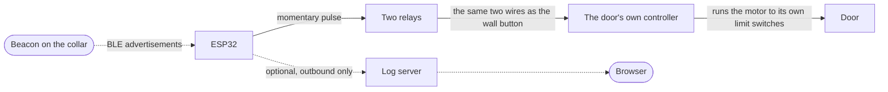

# PetDoor

**Opens a pet door when your animal walks up to it, and closes it again once
they have gone.** No subscription, no vendor account — an ESP32 and a Bluetooth
beacon on the collar are the whole system.

Open source, MIT licensed, and about **$80 all in**.

> 🌐 **[petdoor.aspl.net](https://petdoor.aspl.net)** — overview and a live
> sample dashboard
> 💻 **[Source & full documentation](https://github.com/jchirayath/PetDoor)** —
> everything you need to build one

---

## What it is

An ESP32 listens continuously for a Bluetooth beacon on your pet's collar. When
the beacon has been convincingly close for a moment it pulses an OPEN relay;
when it has been convincingly gone for a while it pulses a CLOSE relay.

The door's own controller still owns the motor and its travel limits. This only
presses its buttons — which is what makes it safe, reversible, and possible to
fit to a door you already own.

| | |
|---|---|
| **~$80** | all in — door, board, beacon and cable |
| **MIT** | open source, build it yourself |
| **0** | vendor accounts — any server is your own |
| **~1 m** | typical open range, fully tunable |

---

## How the pieces fit

Solid arrows are the door working. The dotted ones are optional: the beacon
only ever *advertises*, and the log server is something the door **calls out
to** — never something that reaches in. Unplug the server and the door carries
on opening and closing exactly as before.

## Start here

| If you… | Go to |
|---|---|
| have never used an ESP32 | [[The ESP32\|ESP32]] · [full primer](https://github.com/jchirayath/PetDoor/blob/main/docs/ESP32-PRIMER.md) |
| want to know what to buy | [[Parts and cost]] |
| have a door to convert | [[Converting a door]] |
| are choosing a beacon | [[The beacon]] |
| are about to wire a motor | **[Safety](https://github.com/jchirayath/PetDoor/blob/main/docs/SAFETY.md)** — read this first |
| want to know how it works | [[How it works]] |
| want the log and charts | [[The dashboard]] |
| cannot reach the door any more | [[Running it remotely]] |

---

## Why it exists

My dog refused to go through the flap. He would stand at the door and wait,
which defeats the point of having one — so the flap had to go and something had
to open the door properly, without leaving it open to the weather, the rodents
and next door's cat.

Everything simpler was tried first and rejected:

- **Proximity sensors** — need one on each side, and they open for anything.
- **Weight mats** — placement is awkward and the outdoor one dies in weather.
- **Infrared beam break** — works for anything that breaks the beam. No identity.
- **Cameras with recognition** — expensive, power-hungry, and a lot of machinery
  for a door.

Identity is the whole problem. A beacon on the collar is the cheapest reliable
way to answer *"is it my animal, and is it at the door?"*

---

## The honest limits

**It is not a lock.** Bluetooth advertisements are unauthenticated plaintext, so
the door opens for anything broadcasting your beacon's address — not only for
the beacon. Reading that address takes a free phone app; rebroadcasting it takes
a $10 board. There is no fix within BLE advertising, because there is no shared
secret to verify against.

Fine against weather, rodents and the neighbour's cat. Not a security barrier.
Keep a real lock on anything that matters.

**The animal must wear the beacon.** No beacon, no door.

**You are wiring a motor** attached to a door an animal walks through. The
[safety guide](https://github.com/jchirayath/PetDoor/blob/main/docs/SAFETY.md)
is not optional reading.

---

## Pages

- [[How it works]] — the signal chain, from radio to relay
- [[Parts and cost]] — what to buy and what it costs
- [[The beacon]] — why not an AirTag, and what to use instead
- [[Converting a door]] — tapping an existing controller's buttons
- [[The dashboard]] — the optional log server and its analytics
- [[Running it remotely]] — settings, control, firmware and email once it is on a wall
- [[ESP32]] — the board, for people who have never used one
- [[FAQ]]
